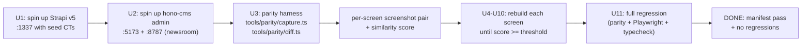

# feat: Strapi pixel-parity admin via agent-browser diff loop

## Summary

Stand up a real Strapi v5 admin app side-by-side with our `@hono-cms` admin. Use the `agent-browser` skill to capture matching screenshots, generate a visual diff manifest, and drive a per-screen rebuild of the hono-cms admin until the screenshots match Strapi pixel-for-pixel — using **our** stack (`@tanstack/{query,router,table,form,pacer,hot-keys}`, `jotai`, `nuqs`, `date-fns`, `shadcn/ui`) instead of Strapi's design-system components.

This is **not** a token-tweaking sweep. Prior passes adopted Strapi colors and call themselves done; the user's frustration is that the *layouts*, *information density*, *header patterns*, *form chrome*, *table chrome*, and *navigation behaviors* still diverge. The diff loop forces a falsifiable definition of "done": **two screenshots overlay to within an acceptable similarity score**.

## Problem Frame

**Today.** The admin at `apps/admin` has Strapi color tokens but Strapi-different layout. The collection rail, content table chrome, edit-record right-pane, media grid card, settings two-pane, and login chrome all read as "shadcn dashboard" rather than "Strapi admin." Previous agents declared parity without ever booting a Strapi app to verify.

**Why this keeps failing.** The agent has been asked to clone Strapi's UI from source code alone. The source code in `.references/strapi/packages/core/admin/admin/src/` reveals what the components are; it does not reveal how they *compose* on the page — spacing rhythm, header heights, badge density, scroll behavior, focus rings, hover treatments — which only show up when the app is running.

**What changes here.** We boot a real Strapi v5 admin (`npx create-strapi@latest`), drive both admins with `agent-browser` along a parallel screen map, capture PNGs, write a per-screen diff manifest, and treat each screen's manifest entry as a precondition for closing that screen's implementation unit. The plan ends when the manifest reports parity for the agreed screen set.

**Why agent-browser is required.** The user explicitly said "make the test with agent browser so you see the whole mismatch yourself." Static screenshots from past sessions exist in `docs/screenshots/` but they only show the *current* hono-cms admin — they do not show Strapi running, so they cannot reveal the gap. Agent-browser captures both sides of the comparison in one session.

## Requirements

- **R1.** A real Strapi v5 app boots locally on `http://localhost:1337` with at least two collection types (Article, Author) so the admin has populated screens for comparison.
- **R2.** A reference screenshot exists at `docs/screenshots/parity/strapi/<screen-id>.png` for each of the 12 canonical screens enumerated below (Screen Map).
- **R3.** A matching screenshot exists at `docs/screenshots/parity/honocms/<screen-id>.png` for each canonical screen.
- **R4.** A `docs/screenshots/parity/manifest.json` records, per screen: `{ screenId, strapiPath, honocmsPath, similarityScore, status: pass|fail, notes }`.
- **R5.** A screen's implementation unit (U4–U10) is "done" when its manifest entry reports `status: pass` and the score exceeds the agreed threshold. The threshold is structural, not pixel-exact (see KTD-2).
- **R6.** Every rebuilt screen uses the stack from `CLAUDE.md`: TanStack {Query, Router, Table, Form, Pacer, Hot-Keys}, jotai, nuqs, date-fns, shadcn/ui. **No** Strapi Design System (`@strapi/design-system`) is added as a dependency.
- **R7.** Rebuild does not regress the existing Playwright E2E suite (currently 7 passing specs).
- **R8.** Rebuild does not regress workspace typecheck (`bun run typecheck` exits 0) or core test suite (currently 117/117).

## Scope Boundaries

### In scope
- Visual + interaction parity for the 12 canonical screens listed under Screen Map.
- Replacing Strapi DS component usage in our codebase **with our stack equivalents** — semantics preserved, not the implementation.
- The agent-browser diff harness as a reusable tool committed under `tools/parity/`.

### Deferred to Follow-Up Work
- Pixel-exact font rendering (system font differences between macOS Safari and Chromium will always diverge — see KTD-2).
- Strapi's review-workflow feature (separate paid product surface).
- Strapi's draft-and-publish multi-stage approvals (we already ship draft/publish; multi-stage is YAGNI).
- Internationalization of the *admin UI itself* (vs. content i18n which already exists).
- Mobile/tablet responsive parity (Strapi's admin is itself desktop-only; matching that limitation is fine).

### Outside this product's identity
- Strapi's plugin marketplace UI.
- Strapi's EE-only features (Audit logs *with* SSO chaining, SSO config UI, Single-Sign-On Provider list).
- Strapi's "Try Strapi Cloud" upsells and trial banners.

## High-Level Technical Design



*This illustrates the loop, not implementation specification.* The harness in U3 is the falsifier — it should land before the rebuild units (U4–U10) so each rebuild can be scored objectively against Strapi.

## Output Structure

```text
tools/parity/
  capture.ts            # agent-browser orchestrator: drives both admins, saves PNGs
  diff.ts               # pixel-diff + structural-similarity scoring; emits manifest
  screen-map.ts         # canonical screen list with URL pairs and viewport spec
  README.md             # how to run the harness locally

docs/screenshots/parity/
  strapi/               # reference shots from running Strapi v5
    01-login.png
    02-dashboard.png
    03-content-list.png
    ... 12 total
  honocms/              # matching shots from running hono-cms admin
    01-login.png
    ... 12 total
  manifest.json         # diff results, regenerated on each capture run
  diff-overlays/        # side-by-side composites for review
```

## Key Technical Decisions

### KTD-1: Run real Strapi, not just read source

Strapi source is in `.references/strapi/` — but reading source does not surface composition decisions (heights, gaps, hover states). Booting Strapi v5 via `npx create-strapi@latest --quickstart` in a scratch directory at `/tmp/strapi-parity-ref/` produces the running app whose screenshots are the contract. The Strapi app is never committed — it is regenerated on demand and noted in `.gitignore`.

### KTD-2: Structural similarity, not pixel-exact

System fonts, antialiasing, and OS rendering will always diverge. The similarity score is structural — components in the same regions, same proportions, same color families — computed via [pixelmatch](https://github.com/mapbox/pixelmatch) with a perceptual threshold of `0.10` (10% pixel delta budget across the frame), plus a manual review pass for layout-level matches that pixelmatch over-penalizes. A failing score never blocks closing a unit unilaterally; it triggers a review where the implementer either fixes the gap or annotates the manifest with `notes: "intentional divergence — <reason>"`.

### KTD-3: Strapi components → our stack 1:1 mapping table

| Strapi DS component | Our stack equivalent |
|---|---|
| `Layout` / `ContentLayout` | Tailwind grid wrapper + `SettingsShell` |
| `HeaderLayout` (page header w/ primary action) | New `PageHeader` component using shadcn `Button` + Strapi tokens already in admin.css |
| `MainNav` (left sidebar) | Existing `AppFrame.tsx` `<aside>` — refactored against Strapi's structural model |
| `Badge` / `Status` | shadcn `Badge` + a `<StatusBadge variant=...>` thin wrapper |
| `Box` / `Stack` / `Flex` | Tailwind utility classes — no wrapper components |
| `Table` (with sticky header + selection) | `@tanstack/react-table` + shadcn `Table` chrome |
| `TextInput`, `Select`, `Combobox`, `Textarea`, `Checkbox`, `Toggle` | shadcn equivalents — all already added |
| `Modal` / `Dialog` | shadcn `Dialog` / `Sheet` |
| `Toast` | `sonner` (already wired) |
| `Tabs` | shadcn `Tabs` |
| `MultiSelectNested` (CT field-type picker) | shadcn `Popover` + `Command` |

This is the source-of-truth mapping. Implementation units cite the row they implement.

### KTD-4: Diff harness is committed code, not throwaway

Past sessions used ad-hoc screenshots that drift. `tools/parity/` lives in the repo and runs via `bun tools/parity/capture.ts && bun tools/parity/diff.ts`. The manifest is regenerated, never hand-edited. Anyone can re-run the harness and see whether claims of parity hold.

### KTD-5: Agent-browser via the loaded skill

The `agent-browser` skill is listed as available. The harness invokes it via the harness's own CLI — both manually driven (`bun tools/parity/capture.ts --screen=03-content-list`) and CI-friendly. Skill invocation patterns follow the skill's own examples; no MCP-server detours required.

### KTD-6: Existing chartdb visualizer stays, but does not block parity

The G2-shipped chartdb-style CT canvas (`apps/admin/src/components/visualizer/*`) is hono-cms's *extension* of the CT-Builder concept, not a replacement of Strapi's Content-Type Builder UX. Both surfaces exist: U10 brings the form-based CT Builder to Strapi parity; the canvas remains as a power-user view reachable from the same nav entry via a tab. The "Open form view" drawer remains the bridge.

## Screen Map

These 12 screens are the parity contract. Each has a paired URL on Strapi and on hono-cms admin.

| ID | Screen | Strapi path | hono-cms path | Owning IU |
|---|---|---|---|---|
| 01 | Login | `/auth/login` | `/login` | U5 |
| 02 | Dashboard / Home | `/` | `/content` (closest analog) | U4 (shell), U6 (default landing) |
| 03 | Collection list (with rows) | `/content-manager/collection-types/api::article.article` | `/content/articles` | U6 |
| 04 | Collection list — filter chip open | as above + filter dropdown | as above + filter | U6 |
| 05 | Record edit | `/content-manager/collection-types/api::article.article/1` | `/content/articles/<id>` | U7 |
| 06 | Record edit — right info panel | as above (default visible) | as above | U7 |
| 07 | Media library — grid | `/plugins/upload` | `/media` | U8 |
| 08 | Media library — upload modal | grid + upload | media + upload | U8 |
| 09 | Settings home | `/settings/application-infos` (default landing) | `/settings/health` (default landing) | U9 |
| 10 | API tokens list | `/settings/api-tokens` | `/settings/api-keys` | U9 |
| 11 | Content-Type Builder (form view) | `/plugins/content-type-builder/content-types/api::article.article` | `/settings/content-types` | U10 |
| 12 | Content-Type Builder — add field modal | as above + add-field dialog | as above + add-field dialog | U10 |

---

## Implementation Units

### U1. Reference Strapi v5 instance

**Goal:** A real Strapi v5 admin runs at `http://localhost:1337` with seed content types (Article, Author) and at least one record per CT. This is the visual ground truth for every subsequent unit.

**Requirements:** R1.

**Dependencies:** none.

**Files:**
- `tools/parity/setup-strapi.sh` (new) — bootstraps `/tmp/strapi-parity-ref/` via `npx create-strapi@latest`, configures SQLite + quickstart, seeds CTs and one record each via the Strapi CLI/REST.
- `tools/parity/README.md` (new) — operator instructions.
- `.gitignore` (modify) — add `/tmp/strapi-parity-ref/` if applicable, but since `/tmp` is outside the repo this is documentation only.

**Approach:**
- Use `npx create-strapi@latest /tmp/strapi-parity-ref --quickstart --no-run --skip-cloud --no-example` (verify flags against current Strapi v5 CLI before scripting; flags drift across releases).
- Seed via `strapi develop` boot + REST API call to `/content-type-builder/content-types` for Article (`title:string`, `slug:uid`, `body:richtext`, `cover:media`, `author:relation→Author`) and Author (`name:string`, `email:email`).
- The script is idempotent: if `/tmp/strapi-parity-ref/` exists with a healthy `node_modules/`, skip create and just start.

**Patterns to follow:** None internally — this is a new tool dir.

**Test scenarios:**
- The script exits 0 on a clean machine with Node 20+ and `npx` on PATH.
- After running, `curl http://localhost:1337/admin` returns 200 (HTML).
- After running, `curl -H "Authorization: Bearer <admin-token>" http://localhost:1337/api/articles` returns at least one record.
- The script is idempotent on second run (no destructive re-init).
- Test expectation: smoke-level only — this is operator scaffolding, not product code; covered by U3 harness's first invocation.

**Verification:** Operator can run `bash tools/parity/setup-strapi.sh` and have Strapi available at `:1337` within ~5 minutes (first run; cached on subsequent runs).

---

### U2. Hono-cms admin booted for capture

**Goal:** Admin runs at `http://localhost:5173` against the newsroom CMS at `http://localhost:8787`, populated with at least the same two content types and one record each, so capture pairs are like-for-like.

**Requirements:** R3.

**Dependencies:** none (newsroom example already exists at `examples/newsroom`).

**Files:**
- `tools/parity/setup-honocms.sh` (new) — boots `examples/newsroom` dev-server + `apps/admin` vite, waits for both to be reachable, seeds `articles` + `authors` via REST.
- `examples/newsroom/src/seed-parity.ts` (new or amend existing seed) — idempotent seed for two CTs and one record each.

**Approach:**
- The newsroom example already defines `articles` and `authors`. Verify the seed file populates one record per CT; extend if needed.
- Script uses `bun --filter @hono-cms/example-newsroom dev` and `bun --filter @hono-cms/admin-spa dev` in parallel via concurrently-pattern; backgrounds with health-check polls.

**Patterns to follow:** Existing newsroom dev-server boot path; `playwright.config.ts` webServer config showed the right pattern.

**Test scenarios:**
- Script exits 0; both ports listening; `curl http://localhost:5173` returns HTML and `curl http://localhost:8787/cms/health/live` returns 200.
- `articles` returns at least one record over REST.
- Test expectation: smoke-only — see U1 reasoning.

**Verification:** Operator can run `bash tools/parity/setup-honocms.sh` and reach the populated admin within ~30 seconds.

---

### U3. Parity capture + diff harness

**Goal:** A reusable, committed CLI that drives both admins via agent-browser, captures the 12 canonical screens for each, scores them with pixelmatch, and emits `manifest.json`. This is the falsifier the rest of the plan rides on.

**Requirements:** R2, R3, R4.

**Dependencies:** U1, U2.

**Files:**
- `tools/parity/screen-map.ts` (new) — exports `SCREEN_MAP: Array<{ id, label, strapi: {path, prep?}, honocms: {path, prep?}, viewport }>`.
- `tools/parity/capture.ts` (new) — orchestrator; takes `--side=strapi|honocms|both` and `--screen=<id>|all`; invokes agent-browser to navigate, run optional `prep` actions (e.g., "click filter chip"), and save PNG to `docs/screenshots/parity/<side>/<id>.png`. Handles auth (Strapi has an admin user prompt on first boot; hono-cms uses Bearer admin via storage seed).
- `tools/parity/diff.ts` (new) — reads both PNGs per screen via pngjs, scores via pixelmatch with `threshold: 0.10`, writes side-by-side composite to `docs/screenshots/parity/diff-overlays/<id>.png`, and emits `docs/screenshots/parity/manifest.json`.
- `tools/parity/types.ts` (new) — shared types (`ScreenSpec`, `ManifestEntry`).
- `package.json` (workspace root, modify) — add devDeps `pixelmatch`, `pngjs` (or `sharp` if it covers both needs in one dep — decision at write time, pick the lighter tree).
- `tools/parity/README.md` (modify) — operator usage.

**Approach:**
- The harness has two top-level commands: `capture` (drives the browser) and `diff` (scores existing PNGs). Keep them separated so capture is interactive-heavy and diff is fast/CI-friendly.
- agent-browser invocation: dispatched via the loaded skill; each screen entry has `prep: (browser) => Promise<void>` for screen-specific setup (open filter, scroll into modal, etc.).
- Auth: on Strapi first-run the admin creates a user; the script accepts `STRAPI_PARITY_ADMIN_EMAIL` / `STRAPI_PARITY_ADMIN_PASSWORD` env vars and reuses across runs.
- The manifest is regenerated, not mutated; old entries are dropped on each diff run.

**Patterns to follow:** None internally. `apps/admin/playwright.config.ts` shows a similar webServer-orchestration pattern at a smaller scale.

**Test scenarios:**
- Running `bun tools/parity/capture.ts --side=both --screen=01-login` produces `docs/screenshots/parity/strapi/01-login.png` and `docs/screenshots/parity/honocms/01-login.png`.
- Running `bun tools/parity/diff.ts` with only one side captured emits an entry with `status: incomplete` rather than crashing.
- Running diff over a matching pair emits `status: pass`; over a deliberately-different pair (different viewport) emits `status: fail`.
- Manifest is valid JSON parseable by `JSON.parse`.
- The harness is deterministic: same inputs → same scores.
- Unit test for `diff.ts`'s scoring function in `tools/parity/__tests__/diff.test.ts` (covers happy path, missing input, threshold boundary).

**Verification:**
- `bun tools/parity/capture.ts --side=both --screen=all` produces 24 PNG files.
- `bun tools/parity/diff.ts` produces a manifest with 12 entries and at least 12 diff-overlay PNGs.
- `bun --filter @hono-cms/admin-spa typecheck` still exits 0 (harness lives outside admin but should not break shared types).

---

### U4. AppFrame: Strapi MainNav structural parity

**Goal:** The left sidebar matches Strapi's `MainNav` structure: brand header strip, grouped nav with section labels, item icons at `size={15}`, active rule (`border-l-2`), hover treatment, footer user chip. The current dark sidebar is correct in palette; this unit aligns spacing, label rhythm, and icon size against Strapi's actual `:1337` rendering, not against the static `MainNav.tsx` source alone.

**Requirements:** R3, R6, R7, R8. Screens: 02 (shell visible on every screen).

**Dependencies:** U3 (harness exists), U1+U2 (apps booted).

**Files:**
- `apps/admin/src/components/views/AppFrame.tsx` (modify).
- `apps/admin/src/components/views/AppFrame.test.tsx` (new) — RTL tests for nav-link grouping + active-state class application.

**Approach:**
- Capture screen 02 from Strapi; overlay onto current hono-cms. Identify the top 5 structural deltas (likely: brand-strip height, section-label tracking, nav-link vertical padding, icon size, user-chip placement). Adjust in-place.
- Cite KTD-3 row "MainNav" — refactor against Strapi's structural model, no Strapi DS.

**Patterns to follow:** `.references/strapi/.../components/MainNav/MainNav.tsx`, `NavLink.tsx`, `NavBrand.tsx`, `NavUser.tsx` — read for structure, do not copy code.

**Test scenarios:**
- Each section heading (`Content Manager`, `Plugins`, `General`, etc. — mapped to hono-cms equivalents `Workspace`, `Schema`, `System`) renders with consistent typography.
- Active route applies `border-l-2 border-[#4945ff] bg-[#271fe0]/25 text-white`.
- Icon sizes are uniform at `size={15}`.
- Sidebar collapses on small viewports without breaking layout (use viewport `< 1024px` toggle).
- Footer user chip renders email + role; menu opens on click.
- Parity: `docs/screenshots/parity/manifest.json` screen `02-dashboard` reaches `status: pass`.

**Verification:** Manifest screen 02 = pass. Playwright smoke specs still pass. Component test suite green.

---

### U5. Auth flow: UnauthenticatedLayout parity

**Goal:** Login, register, forgot-password, magic-link, 2fa screens match Strapi's `UnauthenticatedLayout`: centered card on dark-navy full-bleed background, brand mark above card, footer help link below card, single-column form, primary button full-width.

**Requirements:** R3, R6. Screen: 01.

**Dependencies:** U3.

**Files:**
- `apps/admin/src/components/views/AuthView.tsx` (modify — 363 lines currently; this is shell-layout work, not a rewrite).
- `apps/admin/src/components/views/AuthView.test.tsx` (new or extend existing).

**Approach:**
- Capture screen 01; overlay onto current hono-cms login. Likely deltas: card width (Strapi uses ~448px, we use 400px), card padding rhythm, brand-above-card spacing, button rounded-corners (Strapi is `rounded-md` not `rounded-lg`).
- Cite KTD-3 mappings: TextInput→shadcn Input, Button→shadcn Button.

**Patterns to follow:** `.references/strapi/.../layouts/UnauthenticatedLayout.tsx`, `.references/strapi/.../pages/Auth/`.

**Test scenarios:**
- Login form submits via `useForm`; on error, an Alert appears below the form (not inline-per-field).
- "Forgot password?" link routes correctly.
- 2FA challenge shows code input + resend button.
- Magic-link request renders confirmation state ("Check your inbox") after submit.
- Parity: manifest screen 01 = pass.

**Verification:** Manifest 01 = pass. Existing `smoke.spec.ts > login page renders branded auth shell` still passes.

---

### U6. Content list view: Strapi ListView parity

**Goal:** The content list (`/content/articles`) matches Strapi's `ListView` page: page header with collection name + count, primary "Create new entry" action top-right, filter chips row, table with checkbox column + sticky header + 54px rows, pagination footer, and an info-panel-aware right rail when a row is selected.

**Requirements:** R3, R6, R7. Screens: 03, 04.

**Dependencies:** U3, U4.

**Files:**
- `apps/admin/src/components/views/ContentWorkspace.tsx` (modify — 1059 lines; surgical edits to layout regions).
- `apps/admin/src/components/views/ContentWorkspace.test.tsx` (new or extend).

**Approach:**
- Compare screens 03 and 04 against Strapi. Confirm column header bg `#f6f6f9`, row hover `#f6f6f9`, row height 54px (already correct per G3), filter chip pill shape, status badge placement, pagination control style.
- Add filter dropdown matching Strapi's pattern (chip → popover with operator + value).
- Cite KTD-3 row "Table" — `@tanstack/react-table` already in use; this unit tightens layout.

**Patterns to follow:** `.references/strapi/.../content-manager/admin/src/pages/ListView/`.

**Test scenarios:**
- Header shows collection name, record count, and primary action.
- Filter chip opens popover; choosing operator + value updates URL via `nuqs` and re-fetches via `useQuery`.
- Checkbox column toggles row selection; selection persists across pagination as long as URL query is stable.
- Sort indicator on column header toggles ascending → descending → off.
- Pagination shows page number, per-page select, total count.
- Parity: manifest screens 03 and 04 = pass.

**Verification:** Manifest 03 + 04 = pass. Existing `content.spec.ts` and `audit.spec.ts` still pass.

---

### U7. Record edit view: Strapi EditView parity

**Goal:** The record edit page (`/content/articles/<id>`) matches Strapi's `EditView`: top bar with breadcrumbs + status + publish/save actions, two-column main area (form left, "Information" right panel), field-group cards, relation modal opens on relation-field click, draft/publish toggles in the right panel.

**Requirements:** R3, R6, R7. Screens: 05, 06.

**Dependencies:** U3, U6.

**Files:**
- `apps/admin/src/components/views/ContentWorkspace.tsx` (modify — record-editor region only).
- `apps/admin/src/components/views/ContentWorkspace.test.tsx` (extend).

**Approach:**
- Compare screens 05 and 06. Confirm right-panel width (`280px`), section spacing in the panel (`Information`, `Locale`, `Stage`, `Last update by`, etc.), and primary action placement (publish in top-right, save below).
- The relation modal already exists in some form (RelationConnectionDialog from G2); confirm its shape matches Strapi's relation picker.
- Cite KTD-3 rows "HeaderLayout" and "Modal".

**Patterns to follow:** `.references/strapi/.../content-manager/admin/src/pages/EditView/`.

**Test scenarios:**
- Top bar renders breadcrumbs + status pill + Save/Publish buttons.
- Right panel renders Information section with createdAt, updatedAt, lastUpdatedBy.
- Clicking a relation field opens the relation picker modal; selecting + saving wires the relation and closes the modal.
- Unsaved-changes guard fires on navigate-away.
- Parity: manifest 05 + 06 = pass.

**Verification:** Manifest 05 + 06 = pass. Existing `publish.spec.ts` still passes.

---

### U8. Media library: Strapi Upload plugin parity

**Goal:** Media grid view matches Strapi's `/plugins/upload` page: filter bar (search + sort + view toggle grid/list), folder breadcrumb, asset grid with hover state revealing select-checkbox + filename + size, upload modal with drop zone + URL upload + cropping toggle.

**Requirements:** R3, R6. Screens: 07, 08.

**Dependencies:** U3.

**Files:**
- `apps/admin/src/components/views/MediaView.tsx` (modify — 713 lines).
- `apps/admin/src/components/views/MediaView.test.tsx` (new or extend).

**Approach:**
- Compare screens 07 and 08. Confirm card aspect ratio (Strapi is 4:3), hover lifts to show selection checkbox + file metadata, upload modal is a Dialog (not Sheet), drop zone shows file-type icons + size limit copy.
- Cite KTD-3 rows "Modal" and "Stack".

**Patterns to follow:** `.references/strapi/packages/core/upload/admin/src/`.

**Test scenarios:**
- Grid/list view toggle persists to localStorage and to URL via nuqs.
- Sorting changes (`createdAt desc` default → `name asc`) re-orders cards.
- Selecting cards activates the bulk-action bar.
- Upload modal opens; drop zone shows file count after files selected; submit triggers upload mutation and closes modal on success.
- Parity: manifest 07 + 08 = pass.

**Verification:** Manifest 07 + 08 = pass. No new Playwright spec required this unit (G3 already covered media flow conceptually); add a `media.spec.ts` if missing.

---

### U9. Settings shell + API tokens: Strapi Settings parity

**Goal:** Settings hub shows a two-pane layout (left settings sub-nav grouped by section, right content) matching Strapi's settings landing. API tokens list matches `/settings/api-tokens`: table with name, description, type (read-only/full-access), last-used, expires-at; create-new dialog with token name + type select + lifespan select.

**Requirements:** R3, R6. Screens: 09, 10.

**Dependencies:** U3.

**Files:**
- `apps/admin/src/components/views/SettingsLayout.tsx` (modify — 144 lines).
- `apps/admin/src/components/views/ApiKeysView.tsx` (modify).
- `apps/admin/src/components/views/SettingsLayout.test.tsx` (new or extend).

**Approach:**
- Compare screens 09 and 10. Confirm the settings sub-nav uses Strapi's "section header + items" rhythm: `Global Settings`, `Users & Permissions`, `Email`, etc. Map to hono-cms equivalents: `System`, `Schema`, `Security` (Roles), `Integrations` (Webhooks, API tokens).
- Add a "last used" column to API tokens list (backend stores `lastUsedAt` already on the apiKey record; surface it).
- Cite KTD-3 rows "Layout", "Table", "Modal".

**Patterns to follow:** `.references/strapi/.../admin/src/pages/Settings/`.

**Test scenarios:**
- Settings sub-nav active state applies on the current route.
- API tokens table sorts by last-used desc by default.
- Create-token dialog shows the one-time secret only once and dismisses with a copy-to-clipboard action.
- Revoke action prompts confirmation and toasts on success.
- Parity: manifest 09 + 10 = pass.

**Verification:** Manifest 09 + 10 = pass.

---

### U10. Content-Type Builder (form view) parity + visualizer tab

**Goal:** The form-view of the CT Builder matches Strapi's `/plugins/content-type-builder/content-types/...` page: left tree of types and groups, right pane with editable fields list, "Add another field" trigger opens a type-picker dialog (grid of field-type icons), "Save" persists. The chartdb canvas (shipped by G2) lives in a second tab on the same page; the default tab is the form view.

**Requirements:** R3, R6. Screens: 11, 12.

**Dependencies:** U3.

**Files:**
- `apps/admin/src/components/views/ContentTypesView.tsx` (modify — 860 lines).
- `apps/admin/src/app/settings.content-types.tsx` (modify — remove the unconditional redirect added in G2; instead render the form view by default with a tab strip to the visualizer route).
- `apps/admin/src/app/settings.content-types.visualizer.tsx` (modify — becomes a tab destination, not a redirect target).
- `apps/admin/src/components/views/ContentTypesView.test.tsx` (extend).

**Approach:**
- Compare screens 11 and 12. Confirm left-tree styling, field-row chrome, "Add another field" button placement, type-picker dialog grid (4 columns of icons with field-kind name + short description).
- Reverse the G2 redirect: `/settings/content-types` lands on form view; `/settings/content-types/visualizer` is the canvas tab.
- Cite KTD-3 rows "MultiSelectNested" (field-type picker → `Popover` + `Command`) and "Modal".

**Patterns to follow:** `.references/strapi/packages/core/content-type-builder/admin/src/`.

**Test scenarios:**
- Form view loads at `/settings/content-types` (no redirect to visualizer).
- Tab strip shows "Form" (default) and "Visualizer" tabs; clicking tab routes without unmount-remount of unrelated state.
- "Add another field" opens type-picker dialog showing all supported field kinds with icon + name.
- Selecting a field kind closes the picker and opens a field-config inline editor.
- Save persists the changes through `client.updateContentType()`.
- Parity: manifest 11 + 12 = pass.

**Verification:** Manifest 11 + 12 = pass. Existing G2 chartdb canvas still functional in the visualizer tab.

---

### U11. Full regression: parity + Playwright + typecheck

**Goal:** Lock the gains. Re-run the full capture + diff harness over all 12 screens. Re-run the Playwright suite (7 specs). Re-run workspace typecheck.

**Requirements:** R5, R7, R8.

**Dependencies:** U4–U10.

**Files:**
- `docs/screenshots/parity/manifest.json` (regenerated).
- `docs/screenshots/parity/REPORT.md` (new) — human-readable summary table generated from the manifest, listing each screen and its status.
- `tools/parity/report.ts` (new) — produces `REPORT.md` from `manifest.json`.

**Approach:**
- `bun tools/parity/capture.ts --side=both --screen=all` regenerates all 24 PNGs.
- `bun tools/parity/diff.ts` regenerates `manifest.json` + diff overlays.
- `bun tools/parity/report.ts` writes `REPORT.md`.
- `cd apps/admin && bunx playwright test --reporter=line` re-runs the E2E suite.
- `bun run typecheck` re-runs workspace typecheck.

**Test scenarios:**
- All 12 manifest entries have `status: pass` (any `fail` is an actionable bug to fix or annotate as intentional divergence with rationale).
- Playwright suite: 7 passed.
- Typecheck: exit 0.
- Core tests: 117 passed (no regression from C7 baseline).

**Verification:** Single command `bash tools/parity/full-regression.sh` runs all four steps and exits 0 if all pass.

---

## System-Wide Impact

| Surface | Touched? | Notes |
|---|---|---|
| `apps/admin/src/components/views/AppFrame.tsx` | Yes (U4) | Structural alignment to Strapi MainNav. |
| `apps/admin/src/components/views/AuthView.tsx` | Yes (U5) | Card width, button rounding, brand-card spacing. |
| `apps/admin/src/components/views/ContentWorkspace.tsx` | Yes (U6, U7) | List view chrome + edit view right panel. |
| `apps/admin/src/components/views/MediaView.tsx` | Yes (U8) | Card hover + upload modal. |
| `apps/admin/src/components/views/SettingsLayout.tsx` + `ApiKeysView.tsx` | Yes (U9) | Settings sub-nav + tokens list. |
| `apps/admin/src/components/views/ContentTypesView.tsx` + visualizer route | Yes (U10) | Form view becomes default; visualizer becomes tab. |
| Backend (`packages/core`, `packages/schema`, adapters) | No | Visual rebuild only. |
| Examples (`examples/*`) | No | Unchanged. |
| Tools (`tools/parity/*`) | New | Diff harness + setup scripts. |
| Docs (`docs/screenshots/parity/*`) | New | Reference + result screenshots + manifest. |
| Workspace `package.json` | Yes | New devDeps for pixelmatch + pngjs (or sharp). |
| `.gitignore` | Yes | Ignore `/tmp/strapi-parity-ref` if user keeps it locally; ignore `node_modules/` patterns under `tools/`. |

## Verification Strategy

**Per-unit:** Each rebuild unit U4–U10 closes only when its manifest entries (per the Screen Map) show `status: pass` and the unit's component tests + Playwright smoke specs still pass.

**End-of-plan:** U11 regenerates the manifest, regenerates `REPORT.md`, runs Playwright, runs typecheck. The plan is "done" when:
1. `manifest.json`: 12/12 entries `status: pass` (or annotated `intentional-divergence`).
2. Playwright: 7/7 specs pass.
3. Typecheck: exit 0.
4. Core tests: 117/117 pass.

## Risks

- **agent-browser cold-start latency** — first capture run may take 5–10 minutes (Strapi npx-create + asset compile). Mitigation: U1 caches `/tmp/strapi-parity-ref/` and is idempotent.
- **Strapi quickstart flag drift** — `npx create-strapi@latest` flags change between minor versions. Mitigation: U1 setup script does a `--help` probe and prints flag table before running.
- **System font drift** — same point size renders different widths on macOS vs Linux CI. Mitigation: KTD-2 threshold at 10% pixel delta + manual review pass.
- **Pixelmatch over-penalizing intentional differences** — e.g., hono-cms branding is "Hono CMS" not "Strapi" — that's text content, not a structural delta. Mitigation: `manifest.json` allows `notes` field to mark intentional divergence; review step is part of U11.
- **Scope creep into product behaviors that diverge from Strapi by design** — e.g., hono-cms's chartdb canvas has no Strapi analog. Mitigation: KTD-6 keeps canvas as additive, not blocking.
- **Workspace dep additions** — adding `pixelmatch` + `pngjs` to root devDeps adds ~1 MB to the lockfile. Mitigation: scoped to root devDeps only, not surfaced to consumers.

## Dependencies / Prerequisites

- Node 20+ + `npx` on PATH (for Strapi create).
- Bun installed (existing repo convention).
- macOS or Linux with Chromium-installable host (agent-browser dependency).
- ~2 GB free disk for the cached Strapi reference app.

## Phased Delivery

| Phase | Units | Outcome |
|---|---|---|
| Setup | U1, U2 | Both apps boot reproducibly. |
| Harness | U3 | Falsifier exists; can score before any rebuild. |
| Rebuild | U4, U5, U6, U7, U8, U9, U10 | Each screen reaches parity in dependency order (shell → auth → content → media → settings → CT builder). |
| Lock | U11 | Full regression + report. |

## Future Considerations

- A CI job that runs `tools/parity/full-regression.sh` on every PR touching `apps/admin/src/components/views/*` would prevent drift after the initial parity is achieved.
- The harness could be generalized as `tools/visual-regression/` if other rebuilds need it (e.g., comparing our docs site against a competitor).
- If Strapi ships a major v6 with a refreshed admin, the manifest baselines become the contract — re-capturing Strapi side regenerates the baseline; failing diffs become the to-do list.
