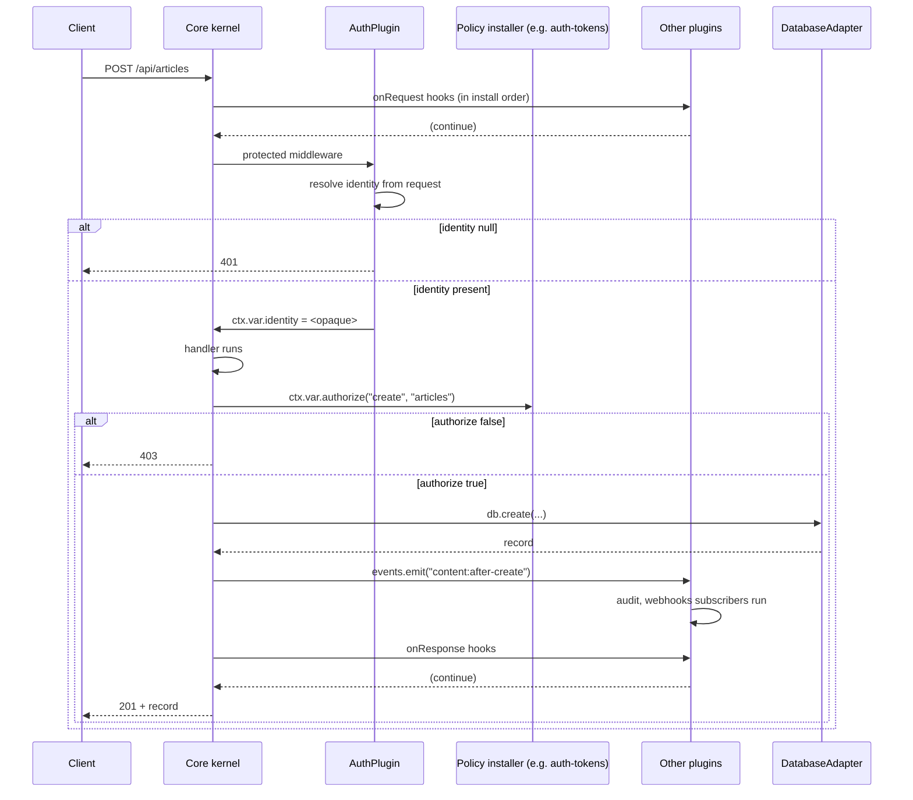
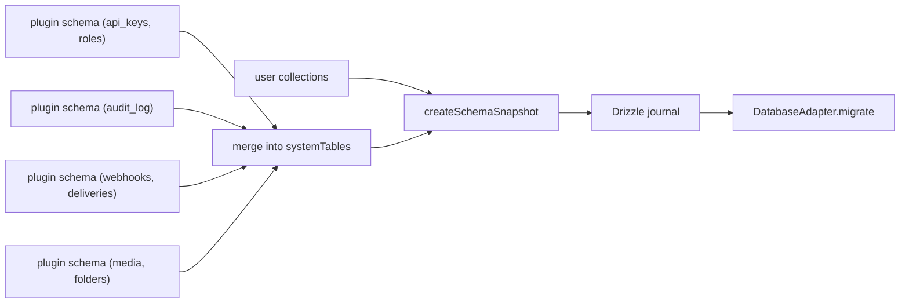

# refactor: Better Auth–style plugin system + kernel cut

## Summary

Replace `@hono-cms/core`'s direct-adapter + side-effect `registerProvider` registry model with a **Better Auth–style declarative plugin manifest** passed via `plugins: [...]`. The 2,553-line `packages/core/src/create-cms.ts` monolith is carved into a thin kernel (plugin runtime + adapter type contracts + minimal content REST + the `protected`/`authorize` glue) plus ~12 first-party plugin packages. Organizations, the built-in static-token/api-key auth providers, and the in-core better-auth glue are deleted outright (no compat shim — pre-1.0). A new `@hono-cms/auth-tokens` plugin (ported from `.references/tiny-auth`) ships as the default auth, owning the `api_keys` and Strapi-style `roles` internal tables, with first-run bootstrap-key written to a project-root file.

This is **not** a backwards-compatible refactor. It is a pre-1.0 architectural reset, justified by: (1) eliminating the side-effect-at-module-load `registerProvider` model that has already caused a Cloudflare Workers regression (see Risk R-3), (2) collapsing two parallel extension surfaces (the weak `CMSPlugin` function shape + the registry) into one declarative manifest, (3) removing scope (organizations, identity ownership) that does not belong in a CMS.

## Problem Frame

**Today.** `packages/core/src/create-cms.ts` owns every cross-cutting feature directly: content REST, GraphQL, openapi, cors, audit, webhooks, i18n, media, jobs, preview, content-type-builder, draft/publish, rate-limit, content-cache. Adapter packages (`packages/adapter-postgres`, `packages/cache`, `packages/jobs`, `packages/storage-s3`, …) register themselves via `registerProvider(...)` at module top-level — a side effect at import time that breaks tree-shaking, breaks Workers global scope (already happened with `MemoryCacheAdapter`'s constructor `setInterval`), and forces config to accept a discriminated `DatabaseAdapter | { provider: string, ... }` union.

The existing `CMSPlugin = (app, ctx) => app | void` is a thin Hono-route hook and nothing else — no schema extension, no hooks, no rate-limit declarations, no `onRequest`/`onResponse`, no service-registry communication, no dependency declarations. Every "real" extension point in the codebase reaches into core's monolith instead.

The auth surface forces a choice between three built-in providers (`static-token`, `api-key`, `better-auth`) wired into `core/src/auth/`. `core` directly imports the `better-auth` package. The session shape is hard-coded to `{ userId, roles }` and authorization is exclusively role-based via `rbac.rules: [{ action, collection, roles }]`. Organizations ship with their own store, 8 routes, and admin views — scope that drifts from "content management" toward identity management.

**Why this keeps biting.** Every new feature lands in `create-cms.ts`. There is no atomic-commit-sized extension surface, no third-party plugin story, no way to ship a feature without modifying core. The handoff doc (`docs/handoff/2026-05-25-plugin-refactor-handoff.md`) captured a long Q&A session where the user reached the conclusion that the architecture itself was the obstacle.

**What changes here.** Core becomes a kernel. Cross-cutting features become independently-versionable plugins that follow a single manifest contract closely mirroring Better Auth's plugin interface (`id`, `requires`, `schema`, `endpoints`/`app`, `hooks.before`/`hooks.after`, `middlewares`, `onRequest`, `onResponse`, `rateLimit`, `trustedOrigins`, `installAuthorize`). Authentication is a **single specialized plugin** (`createAuthPlugin`) producing an opaque identity + a `protected` middleware. Authorization is split out: routes call `ctx.var.authorize(action, collection)`, delegated to whichever policy plugin installs it. The default `@hono-cms/auth-tokens` plugin pairs tiny-auth-style hashed-token api keys with a Strapi-style roles+permissions matrix, both stored in `systemTables` (the channel `@hono-cms/schema` already exposes for non-collection tables).

## Requirements

- **R1.** Core (`@hono-cms/core`) imports zero adapter packages, zero `better-auth`, zero organization code. Its `dependencies` shrink to Hono + Zod-OpenAPI + `@hono-cms/schema`.
- **R2.** `createCMS` accepts a `plugins: readonly Plugin[]` array. There is no `auth:`, `cors:`, `openapi:`, `graphql:`, `cache:`, `jobs:`, `auditLog:`, `webhooks:`, `i18n:`, `contentTypeBuilder:`, or `organizationStore:` config key.
- **R3.** The `Plugin` manifest mirrors Better Auth's surface: `{ id, requires?, schema?, app?, hooks?, middlewares?, onRequest?, onResponse?, rateLimit?, trustedOrigins?, installAuthorize? }`. Where Hono primitives already cover the use case (e.g. `app(app)` returns a Hono instance, so middlewares can be `app.use(...)`), the manifest does not duplicate them — but the field names and intent match Better Auth's.
- **R4.** Exactly one plugin in the array may be an `AuthPlugin` (built via `createAuthPlugin`). Two or more is a `createCMS`-throws-on-boot error.
- **R5.** `createAuthPlugin` produces a `protected` middleware that sets `ctx.var.identity` and returns 401 when identity is null. The identity shape is opaque to core (`unknown` from core's perspective; typed by the plugin).
- **R6.** Per-route authorization is delegated to a `ctx.var.authorize(action, collection, resource?) => boolean | Promise<boolean>` callable. If no policy plugin installs it, the default is `() => true` (no-op — only the `protected` middleware gates).
- **R7.** `@hono-cms/auth-tokens` (the default auth plugin) ships with: `api_keys` internal table (hashed tokens, namespaces, expiry, idle, revoke, refresh, encrypted-secret vault — semantically equivalent to `.references/tiny-auth/service.ts`), `roles` internal table (`{ name, description?, permissions: { [collection]: { [action]: boolean } } }`), `/api/api-keys/*` CRUD, `/api/roles/*` CRUD, first-run bootstrap-key generation that writes one root-scoped key to `<project-root>/.cms-bootstrap-key` and skips on subsequent boots.
- **R8.** Both internal tables flow through the existing `SchemaSnapshot.systemTables` channel (`packages/schema/src/migrations.ts`), so they migrate alongside content collections via one Drizzle journal (preserves Plan 002/004 invariant: one client, one migration surface).
- **R9.** Every feature currently living in `create-cms.ts` (cors, openapi, graphql, audit, webhooks, i18n, media, jobs-runtime, preview, content-type-builder, drafts, rate-limit, content-cache) ships as its own `@hono-cms/<name>` package implementing the `Plugin` manifest. `cache` is also a plugin (not a direct adapter). Cross-plugin communication happens through `ctx.plugins.get("<id>")` (typed service registry) and a named event bus (`ctx.events.emit(...)` / `.on(...)`).
- **R10.** `OrganizationStore` (interface), `MemoryOrganizationStore`, `packages/core/src/organization.ts`, `/cms/settings/organization/*` routes (8 endpoints), and the corresponding admin Settings views are deleted. `docs/api-reference.md` and the OpenAPI description blurb are updated.
- **R11.** `BuiltInAuthConfig`, `createApiKeyAuth`, `createStaticTokenAuth`, `MemoryApiKeyStore`, `createBetterAuth`, `createBetterAuthAdapter`, `isAuthConfig`, `packages/core/src/auth/`, the `apiKeyStore` config slot, and the `/cms/settings/api-keys/*` routes are deleted from core. (Equivalent surfaces live in `@hono-cms/auth-tokens` afterwards.)
- **R12.** Adapter packages migrate from side-effect `registerProvider(...)` at module top-level to explicit factory exports (`postgresAdapter(...)`, `memoryDatabase(...)`, `s3Storage(...)`, `upstashCache(...)`, etc.). User code becomes `createCMS({ db: postgresAdapter({...}), plugins: [...] })`.
- **R13.** `examples/newsroom` is updated end-to-end to the new shape and continues to boot + serve traffic.
- **R14.** Plugin lifecycle ordering is **explicit**: install order = array order. A plugin with `requires: ["cache"]` causes `createCMS` to throw on boot if no plugin with `id: "cache"` appears earlier in the array. No magical topological sort.
- **R15.** Hot-route registration for new content types (today's `create-cms.ts:1017–1075` TrieRouter sub-app pattern) survives the refactor — the `@hono-cms/content-type-builder` plugin owns it and notifies dependent plugins (`graphql`, `openapi`) via the event bus.
- **R16.** A `CONTEXT.md` (glossary: Plugin, AuthPlugin, Identity, Authorize, internal table, kernel) and at least two ADRs land: `0001-plugin-manifest-architecture.md` (supersedes Plan 002 U3) and `0002-delete-organizations-and-builtin-auth.md`.
- **R17.** Event-bus delivery semantics are documented per event family. `content:after-*` and `media:after-*` events: kernel **awaits** `emit()` so the response blocks on handler completion, BUT each handler is required to be **fast and non-blocking** — handlers that do I/O (webhook delivery, external API calls, expensive computation) MUST enqueue a job via `ctx.plugins.get("jobs").enqueue(...)` and return immediately. Handlers that throw produce an `AggregateError` collected after all peers run, ensuring one failing subscriber (e.g. audit DB unavailable) does not block siblings (e.g. webhook enqueue). `schema:after-*` events: same blocking contract. The CONTEXT.md and per-plugin READMEs document the "fast handler" rule prominently.

---

## Scope Boundaries

### In scope
- Full kernel cut of `packages/core/src/create-cms.ts` (described above)
- 12+ new first-party plugin packages
- Deletion of organizations, `BuiltInAuthConfig`, `core/src/auth/better-auth.ts`, the `registerProvider` registry
- Migration of every existing adapter package away from side-effect registration
- `examples/newsroom` migration
- `CONTEXT.md` + ADRs
- `docs/api-reference.md` org-routes removal + OpenAPI description blurb fix

### Outside this product's identity
- **User accounts, signup flows, OAuth, password reset, MFA, magic links** — never owned by the CMS. Bring your own auth plugin.
- **Organizations, teams, invitations, members** — the CMS is for entity management, not identity/orgs. If a consumer needs orgs, they install an auth plugin (`better-auth-organization`, Clerk, …) and the CMS receives whatever identity that plugin produces.
- **A roles UI in the admin SPA** for v1 — the `roles` table is exposed via REST endpoints; admin UI for managing it can be added later but is not in this plan.

### Deferred to Follow-Up Work
- **Admin SPA migration** to the new auth plugin (separate plan; admin uses HTTP routes either way, so a thin compat shim in the admin client is enough until the SPA itself adopts the plugin pattern).
- **Client-side plugin SDK** (Better Auth's `createAuthClient` analog). Server-side first; client can follow.
- **Third-party auth plugin packages** (`@hono-cms/auth-better-auth`, `@hono-cms/auth-clerk`, …) — the *contract* is delivered here; concrete adapters land in follow-up plans.
- **Per-request identity caching** inside `@hono-cms/auth-tokens` (Plan 004 KTD-4 deferred this for better-auth; mirror the deferral here unless benchmarks force it sooner).
- **Schema extension of *existing* collections by a plugin** (Better Auth lets plugins add fields to `user`/`session` tables). The CMS analog is a plugin extending a content collection. Useful but not required for this refactor; design left to a follow-up plan.
- **Removing organization mentions from admin Settings views** — the routes go away, so the admin queries 404; UI cleanup is a separate admin-side task.
- **`/ce-compound` write-up** capturing this refactor's institutional learnings (TrieRouter pattern, cross-runtime side-effect rule, supersession of registry pattern) — recommended by the learnings-researcher.

---

## Key Technical Decisions

### KTD-1: Plugin manifest closely mirrors Better Auth's shape

**Decision.** Mirror Better Auth's plugin manifest field-for-field where the field carries real meaning, adapting types from `better-call` to Hono:

```text
Plugin = {
  id: string;                                        // unique plugin id
  requires?: readonly string[];                      // dependency ids
  schema?: SchemaExtension;                          // internal tables (systemTables channel)
  app?: (app: Hono, ctx: PluginContext) => Hono | void;  // mount routes (Hono replaces Better Call's endpoints)
  hooks?: {
    before?: Array<{ matcher: (ctx) => boolean; handler: MiddlewareHandler }>;
    after?:  Array<{ matcher: (ctx) => boolean; handler: MiddlewareHandler }>;
  };
  middlewares?: Array<{ path: string | RegExp; middleware: MiddlewareHandler }>;
  onRequest?:  (req: Request, ctx: PluginContext) => Response | Request | void | Promise<...>;
  onResponse?: (res: Response, ctx: PluginContext) => Response | void | Promise<...>;
  rateLimit?:  Array<{ pathMatcher: (path: string) => boolean; limit: number; window: number }>;
  trustedOrigins?: readonly string[];
  installAuthorize?: (ctx: PluginContext) => Authorize;
  capabilities?: CMSPluginCapabilities;              // ports forward from current plugins.ts
  mountPhase?: "early" | "normal" | "catchAll";      // default "normal"; only one "catchAll" plugin allowed
};
```

**Rationale.** The user explicitly named Better Auth as the canonical reference ("take as big reference the better auth plugin interface", `docs/handoff/plugin-structure.md`). Mirroring the shape gives users one mental model that travels between Better Auth and the CMS. The Hono adaptation replaces `createAuthEndpoint` (Better Call wrapper) with `app(hono)` because the CMS is already Hono-native; everything else stays one-to-one.

**Non-mirror cases (intentional):**
- No `createAuthClient` analog this plan (deferred — see Scope).
- No `getAtoms`/`getActions` nanostores client surface (admin SPA uses TanStack Query — different paradigm).
- `endpoints` becomes `app(app)` because Hono's app object is the natural endpoint registration primitive; the developer ergonomics match.

**Mirror divergences (acknowledged trade-offs):**
- **Typed client generation is lost.** Better Auth's `createAuthEndpoint` (a Better Call wrapper) attaches input/output Zod schemas to each endpoint, and `createAuthClient` consumes those for type-safe browser-side calls. Replacing `endpoints` with `app(hono)` keeps the same registration ergonomics but **breaks the client-codegen chain** — the admin SPA continues to call routes via hand-rolled fetch + manually-typed responses. Acceptable trade-off because (a) the CMS already has admin-SPA-specific clients (TanStack Query patterns), not an open-ended client SDK, and (b) `createAuthClient` is explicitly out of scope (see Scope Boundaries: Deferred to Follow-Up Work). If a future plan ships a client SDK, it can layer an `endpoints` field on top of the manifest or generate clients from OpenAPI.
- **Service registry typing is `as`-cast, not module-augmented.** Better Auth uses TypeScript module augmentation so `auth.api.<endpoint>()` is precisely typed by the installed plugins. Our `ctx.plugins.get<T>("cache")` requires the caller to supply `T` — accidental misuse is caught only at the call site. A future improvement could mirror Better Auth's pattern via `declare module "@hono-cms/core" { interface CMSPluginServices { cache: CacheAdapter } }`. Logged but not blocking.
- **Identity opacity enforcement is a contract, not a runtime guard.** TypeScript marks `ctx.var.identity` as written-by-AuthPlugin-only via convention; a plugin that defies this can still call `ctx.set("identity", ...)`. We rely on the "exactly one AuthPlugin + auth runs in `early` phase" rule to ensure auth always writes first. A stricter design (sealed slot read-only to non-auth plugins) is deferred — surface in U1's test scenarios that this is enforced by convention.

### KTD-2: Internal tables flow through `SchemaSnapshot.systemTables`, not as collections

**Decision.** Plugin-owned tables (`api_keys`, `roles`, `audit_log`, `webhooks`, `webhook_deliveries`, `media`, `media_folders`, `translations`, `preview_tokens` if persisted) are declared on `Plugin.schema` and merged into `SchemaSnapshot.systemTables` (the channel `packages/schema/src/migrations.ts:8-11` already exposes). They are **not** CMS collections, never appear in `/cms/schema`, never get OpenAPI content-route generation, never appear in the admin Content Manager.

**Rationale.** The plumbing already exists (`packages/cli/src/index.ts:331,355` calls `authSystemTablesFromModule` and `assertNoReservedSystemTableConflicts`). Reusing it preserves the Plan 002/004 invariant that one Drizzle client owns one migration journal across content + auth + plugin tables (`docs/plans/2026-05-16-004-feat-auth-integration-plan.md` KTD-1, KTD-2). Inventing a parallel migration channel would split the journal — the explicit thing we're avoiding.

### KTD-3: Cache becomes a plugin (not a direct adapter)

**Decision.** Promote `cache` from `CMSConfig.cache: CacheAdapter | ProviderConfig` to a plugin. `rate-limit`, `content-cache`, and `preview` declare `requires: ["cache"]` and reach it via `ctx.plugins.get("cache")`.

**Rationale.** Cache today is consumed exclusively by HTTP-layer middleware (rate-limit, content-cache, preview tokens). It is never read by core's content REST handlers directly. That makes it cross-cutting middleware behavior — the definition of plugin. Keeping it as an adapter would force three other plugins to reach into `ctx.adapters.cache`, an alternative DI path that contradicts "everything cross-cutting goes through plugins."

**Counter-consideration.** A future feature might want a content-collection-level cache hint that *core* reads (e.g. `defineCollection({ cache: { ttl: "5m" } })`). If that ever lands, core would need cache access directly — at which point cache moves back to an adapter slot. Today this is hypothetical; promote to plugin now, revisit if the use case appears.

### KTD-4: Two factories — `createPlugin` (generic) and `createAuthPlugin` (specialized)

**Decision.** One declarative manifest type (`Plugin`) but two factory entrypoints:
- `createPlugin(manifest: Plugin): Plugin` — pass-through with type narrowing.
- `createAuthPlugin(manifest: AuthPlugin): AuthPlugin` — same plus a mandatory `protected: MiddlewareHandler` that the kernel wires to every content route. `AuthPlugin extends Plugin`.

`createCMS` scans the plugins array for `AuthPlugin` instances; finding zero or two+ throws.

**Rationale.** The user explicitly rejected a single factory + a `thirdParty` config flag — they wanted two factories so the type system distinguishes "any plugin" from "the auth plugin." Two factories surface intent at the call site: `createAuthPlugin(...)` reads as "this is the thing that produces an identity."

### KTD-5: Explicit-order plugin install with `requires: []`

**Decision.** Plugins install in `plugins[]` array order. Each plugin may declare `requires: readonly string[]`. `createCMS` validates that every required id appears earlier in the array; throws otherwise. No topological sort.

**Rationale.** Explicit order is debuggable; magical sort is not. When `requires` validation fails, the error names the offending plugin and the missing dependency. The user already affirmed this approach in the handoff.

### KTD-6: Identity is opaque; authorization is a separate two-step pipeline

**Decision.** Core never reads inside `ctx.var.identity`. The shape is `unknown` from core's perspective. Authorization is two-step:
1. **Authentication gate (`protected` middleware, from the auth plugin).** Resolves identity → 401 if null → sets `ctx.var.identity` → `await next()`.
2. **Per-route authorization (`ctx.var.authorize(action, collection, resource?)`, installed by a policy plugin or `() => true`).** Called inside each content route handler after `protected` passes. Returns false → handler returns 403.

The auth plugin's `protected` middleware is applied **only** to routes the kernel marks `access: "protected"`. The kernel marks `/api/<collection>/*` protected by default; `auth.publicRead` (a content-level config, not a top-level slot) can downgrade GET to public per collection.

**Rationale.** "Public vs protected" is Strapi-style and matches the user's reference. Identity opacity means the same kernel runs with role-based, scope-based, JWT-claim-based, or anything-else-based identity systems. Granular authorization (collection × action) lives in a separate concern because: (a) it lets `auth-tokens` and `auth-better-auth` share the same authorize plugin, (b) it lets users replace the policy independently of the identity producer, (c) it gives third-party auth plugins a clean granular hook (`rolePolicy(c, { action, collection })`) without forcing role-shape on core.

### KTD-7: Bootstrap key delivered via project-root file, not stdout

**Decision.** When `@hono-cms/auth-tokens` boots and finds zero rows in `api_keys`, it generates one root-scoped key, stores the hash, and writes the raw key to `<project-root>/.cms-bootstrap-key` (path computed via `process.cwd()`). The file is appended to `.gitignore` automatically. Subsequent boots are no-ops.

**Rationale.** User explicitly chose "printed on the root of the project" over stdout/env-var. File persists across process restarts (vs. stdout in serverless), is discoverable (vs. env-var that requires deployment-side action), and is local-development-friendly. For Workers/Edge deployments where `process.cwd()` doesn't exist, the plugin emits a Node-shaped error early and the user must seed the key via an env var (deferred design — see Implementation Unit U7's notes).

### KTD-8: Adapter packages migrate from side-effect `registerProvider` to explicit factory exports

**Decision.** Each adapter package replaces its top-level `registerProvider("db", "postgres", createPostgresAdapter)` with `export function postgresAdapter(config): DatabaseAdapter`. User code becomes:

```text
import { postgresAdapter } from "@hono-cms/adapter-postgres";
createCMS({ db: postgresAdapter({ connectionString, collections }), plugins: [...] });
```

The `registerProvider` / `resolveProvider` / `clearProvidersForTest` exports are deleted from `@hono-cms/core`. The discriminated `db: DatabaseAdapter | ProviderConfig` config union collapses to just `db: DatabaseAdapter`.

**Rationale.** Three reinforcing reasons: (1) Workers/Edge correctness — module-scope side effects already broke once (`docs/cross-runtime/cloudflare-worker.md:55–60`); explicit factory invocation runs inside the request lifecycle. (2) Tree-shakeability — unused adapter packages can be eliminated from bundles. (3) Type ergonomics — users see one shape (`db: <adapter instance>`), not a discriminated union.

This decision explicitly **supersedes Plan 002 U3** ("The registry pattern must be the sole coupling point"), `docs/plans/2026-05-16-002-feat-core-library-plan.md` lines 445–488. The ADR records the supersession.

### KTD-9: No backwards-compatibility shim — pre-1.0

**Decision.** Old config shapes (`db: { provider: "postgres", ... }`, `cors: {...}`, `auth: { tokens: {...} }`, `organizationStore`, …) are removed in one cut. No `deprecated:` field on Plugin, no parallel acceptance of old + new shapes, no codemod. `examples/newsroom` is updated atomically in the same set of changes as the kernel cut.

**Rationale.** Pre-1.0 OSS library. Compatibility shims (a) double the test surface, (b) prolong the carve, (c) reward users who haven't updated yet at the cost of clarity for everyone. The CHANGELOG calls out the breaking change with a migration guide in the same release.

---

## High-Level Technical Design

> *This section illustrates the intended approach and is directional guidance for review, not implementation specification. The implementing agent should treat it as context, not code to reproduce.*

### Plugin manifest (directional)

```text
// Plugin manifest, mirroring Better Auth shape adapted to Hono.
type Plugin = {
  id: string;
  requires?: readonly string[];
  schema?: SchemaExtension;
  app?: (app: Hono<HonoCMSEnv>, ctx: PluginContext) => Hono<HonoCMSEnv> | void;
  hooks?: {
    before?: Array<{ matcher: (c: Context) => boolean; handler: MiddlewareHandler }>;
    after?:  Array<{ matcher: (c: Context) => boolean; handler: MiddlewareHandler }>;
  };
  middlewares?: Array<{ path: string | RegExp; middleware: MiddlewareHandler }>;
  onRequest?:  (req: Request, ctx: PluginContext) => Awaitable<Response | Request | void>;
  onResponse?: (res: Response, ctx: PluginContext) => Awaitable<Response | void>;
  rateLimit?:  Array<{ pathMatcher: (path: string) => boolean; limit: number; window: number }>;
  trustedOrigins?: readonly string[];
  installAuthorize?: (ctx: PluginContext) => Authorize;
  capabilities?: CMSPluginCapabilities;  // ported forward; reads/writes/requiresAdapter/requiresEnv
  mountPhase?: "early" | "normal" | "catchAll";  // default "normal"; only one "catchAll" plugin allowed
};

type AuthPlugin = Plugin & {
  // Required: middleware that resolves identity onto ctx.var.identity.
  // Returns 401 (Response) when identity is null on protected routes.
  protected: MiddlewareHandler;
  // Optional: programmatic resolver if a non-route caller (GraphQL apollo handler) needs it.
  identity?: (c: Context | Request) => Awaitable<Identity | null>;
};

type Authorize = (
  action: "read" | "create" | "update" | "delete" | "publish" | string,
  collection: string | null,
  resource?: ContentRecord | null
) => boolean | Promise<boolean>;
```

### PluginContext + service registry + event bus

```text
type PluginContext = {
  collections: CMSCollections;
  db: DatabaseAdapter;
  storage?: StorageAdapter;             // direct adapter; null if not configured
  mediaStore: MediaStore;               // direct adapter
  env: Record<string, unknown>;
  baseUrl?: string;

  // Cross-plugin DI.
  plugins: {
    get<T = unknown>(id: string): T;     // throws if id not installed
    has(id: string): boolean;
  };

  // Event bus — string-keyed, typed via module augmentation.
  events: {
    on<E extends keyof CMSEvents>(event: E, handler: (payload: CMSEvents[E]) => Awaitable<void>): () => void;
    emit<E extends keyof CMSEvents>(event: E, payload: CMSEvents[E]): Promise<void>;
  };

  // Per-request hook invocation (still supported, fires before/after content REST + GraphQL mutations).
  hooks: HookRegistry;
};

// Module-augmentation-extensible event keys.
interface CMSEvents {
  "schema:after-collection-add":    { name: string; collection: CollectionDefinition };
  "schema:after-collection-remove": { name: string };
  "schema:after-collection-update": { name: string; before: CollectionDefinition; after: CollectionDefinition };
  "content:after-create":           { collection: string; record: ContentRecord; session: AuthSession | null };
  "content:after-update":           { collection: string; record: ContentRecord; before: ContentRecord | null; session: AuthSession | null };
  "content:after-delete":           { collection: string; id: string; session: AuthSession | null };
  "content:after-publish":          { collection: string; record: ContentRecord; session: AuthSession | null };
  "content:after-unpublish":        { collection: string; record: ContentRecord; session: AuthSession | null };
  "media:after-upload":             { record: MediaRecord; session: AuthSession | null };
  "media:after-delete":             { record: MediaRecord; session: AuthSession | null };
}
```

### Request lifecycle for a content route (Mermaid)



### Schema merging



Plugins declare `schema: { tableName: { fields, modelName?, disableMigration? } }`. The kernel collects them at install time and passes `systemTables` to `createSchemaSnapshot(collections, { systemTables })` — the slot already exists in `packages/schema/src/migrations.ts`. One Drizzle journal, one migration surface (Plan 002/004 invariant preserved).

---

## Output Structure

The plan creates a kernel rewrite + ~12 new packages. Expected layout:

```
packages/
├── core/                                  # KERNEL (shrunk from 2,553 lines → ~250)
│   ├── src/
│   │   ├── create-cms.ts                  # kernel only: plugin runtime + content REST
│   │   ├── plugins/
│   │   │   ├── types.ts                   # Plugin, AuthPlugin, PluginContext, Authorize
│   │   │   ├── factories.ts               # createPlugin, createAuthPlugin
│   │   │   ├── runtime.ts                 # validate, order, install pipeline
│   │   │   ├── service-registry.ts        # ctx.plugins.get/has
│   │   │   ├── event-bus.ts               # ctx.events.on/emit
│   │   │   └── schema-merge.ts            # collect plugin schemas → systemTables
│   │   ├── content/                       # minimal REST surface (kept)
│   │   ├── types/                         # adapter type contracts (kept; trimmed)
│   │   └── index.ts                       # re-exports
│   └── package.json                       # deps: hono, @hono/zod-openapi, @hono-cms/schema
├── auth-tokens/                           # NEW — default auth + policy
│   ├── src/
│   │   ├── plugin.ts                      # createAuthPlugin(...) export
│   │   ├── tables/{api-keys,roles}.ts     # schema declarations
│   │   ├── service/                       # tiny-auth-ported token service
│   │   ├── routes/{api-keys,roles}.ts     # /api/api-keys/*, /api/roles/*
│   │   ├── bootstrap.ts                   # first-run key generation + file write
│   │   ├── authorize.ts                   # installAuthorize() reading roles table
│   │   └── __tests__/
│   └── package.json
├── cors/                                  # NEW — trivial smoke-test plugin
├── openapi/                               # NEW — spec + docs UI
├── graphql/                               # NEW — apollo handler + SDL + session bridge
├── cache/                                 # CHANGED — now a plugin, not just adapter
├── jobs-runtime/                          # NEW — /cms/jobs/* + scheduling
├── rate-limit/                            # NEW — middleware (requires cache)
├── content-cache/                         # NEW — middleware (requires cache)
├── preview/                               # NEW — /api/preview-tokens/* (requires cache)
├── audit/                                 # NEW — /cms/audit-log + content:after-* hooks
├── webhooks/                              # NEW — /cms/settings/webhooks/* + retry/sweep
├── i18n/                                  # NEW — /cms/admin/i18n/* + translation jobs
├── media/                                 # NEW — /api/media/* + folders + presign/confirm
├── drafts/                                # NEW — draft/publish state + scheduled-publish
└── content-type-builder/                  # NEW — /cms/content-types/* + hot-route registration
```

**Deleted from `packages/core/src/`**: `audit.ts`, `auth/`, `auth.ts`, `media.ts`, `organization.ts`, `webhooks.ts`, `providers/factories.ts`, `providers/registry.ts`, `openapi*.ts`, `graphql/`, `content/i18n.ts`, `content/preview.ts`, `content/translation.ts`, `content/cache.ts`, `content/publish.ts` (partial — keeps publish state primitives, moves orchestration to `@hono-cms/drafts`).

**Existing adapter packages migrated (not new)**: `adapter-memory`, `adapter-postgres`, `adapter-d1`, `adapter-turso`, `adapter-convex`, `storage-local`, `storage-memory`, `storage-r2`, `storage-s3`, `storage-vercel-blob` — each replaces top-level `registerProvider(...)` with a named factory export.

The tree is a scope declaration. Per-unit `Files:` sections remain authoritative.

---

## System-Wide Impact

| Surface | Impact |
|---|---|
| **`packages/core`** | Shrinks from 2,553 → ≤300 lines in `create-cms.ts`. Drops `dependencies` on `better-auth`. |
| **`packages/schema`** | No interface change; `systemTables` channel is the seam plugins use. `assertNoReservedSystemTableConflicts` may need to be exported (it's used in CLI). |
| **`packages/cli`** | Already uses `authSystemTablesFromModule`; needs minor refactor to read plugin-contributed `systemTables` from a plugin's module exports the same way it reads from the current auth module. |
| **`apps/admin`** | Hits `/cms/settings/api-keys/*` and `/cms/settings/organization/*` — first moves to `/api/api-keys/*` (plugin route), second 404s (deleted). Admin Settings views for orgs must be removed in a follow-up task. Admin uses HTTP, so its session bridge to the API doesn't change. |
| **`examples/newsroom`** | Full rewrite of `createCMS(...)` call to use `plugins: [...]`. Updated in this plan. |
| **All 10 existing adapter packages** | Each loses its top-level `registerProvider(...)`, gains a named factory export. Public API of each package changes. |
| **`docs/api-reference.md`** | Drop the 8 organization routes (lines 146–156) and the OpenAPI description blurb at :116. |
| **`docs/openapi.md` / OpenAPI runtime spec** | No more `/cms/settings/organization/*` paths. |
| **External plugin authors** | The contract they would build against. Today: nothing meaningful (`CMSPlugin` is too weak). After: full manifest. |
| **CI/CD** | Turbo `build` graph gets ~12 new package nodes. `bun install` lockfile churn expected. No CI workflow changes needed beyond running `bun test` on the new packages. |
| **No external contract surfaces** (env vars consumed by other repos, public CLI flags) | None affected — this is internal architecture. |

---

## Implementation Units

Units are grouped into 8 sequential phases. Within a phase, units may proceed in parallel unless a `Dependencies:` line forces ordering. U-IDs are stable.

> **Execution note (applies to all carve units U10–U22):** Each carve is **port-then-delete**. Port the existing implementation from `packages/core/src/<...>` into the new plugin package, write tests against the plugin's exported `Plugin` manifest, then delete the original code from core in the same commit. Avoid the half-state where both copies exist.

---

### Phase 0 — Plugin Runtime Foundation

#### U1. Define core plugin manifest types

**Goal.** Establish the canonical `Plugin`, `AuthPlugin`, `PluginContext`, `Authorize`, `SchemaExtension`, `CMSEvents` types in `@hono-cms/core` with no runtime behavior yet.

**Requirements.** R1, R3, R5, R6.

**Dependencies.** None.

**Files.**
- `packages/core/src/plugins/types.ts` (new)
- `packages/core/src/plugins/__tests__/types.test.ts` (new — type-level tests via `vitest`)
- `packages/core/src/index.ts` (modify — re-export new types)
- `packages/core/src/plugins.ts` (modify — keep `validatePluginCapabilities` + `CMSPluginError`; remove `CMSPlugin` function shape; mark transition state)

**Approach.**
- Mirror Better Auth's manifest field-for-field (see KTD-1 sketch). Document each field with a one-line JSDoc citing the Better Auth equivalent.
- `Plugin.app` returns `Hono<HonoCMSEnv> | void` — same env type the kernel uses.
- `AuthPlugin extends Plugin` adds `protected: MiddlewareHandler` (required) and `identity?: (req: Request) => Awaitable<Identity | null>` (optional, but **request-pure** — see U21 contract note).
- `Authorize` signature exactly: `(action, collection, resource?) => boolean | Promise<boolean>`.
- `Identity` is `unknown` from core's perspective; plugins narrow with their own module-augmentation.
- `CMSEvents` interface is module-augmentable so plugins can add their own event keys (`declare module "@hono-cms/core" { interface CMSEvents { "myplugin:foo": {...} } }`).
- Carry forward `CMSPluginCapabilities` from `packages/core/src/plugins.ts` as an optional `Plugin.capabilities` field; carry forward `CMSPluginError`.

**Patterns to follow.** `packages/core/src/types/{config,instance,providers}.ts` for the type-export pattern. `packages/core/src/plugins.ts` for `validatePluginCapabilities` shape.

**Test scenarios.**
- Type-level: `createPlugin({ id: "foo" })` infers as `Plugin`; `createAuthPlugin({ id: "auth", protected: middleware })` infers as `AuthPlugin`; missing `protected` is a TypeScript error.
- Type-level: `CMSEvents` is module-augmentable — augmenting it with a custom event in a test module and asserting the key is accepted by `ctx.events.on`.
- Type-level: `Plugin.requires` is `readonly string[] | undefined`.
- Runtime: `CMSPluginError` is still thrown by `validatePluginCapabilities` for unknown collections, missing adapter capabilities, missing env vars (existing tests in `packages/core/src/__tests__/auth-plugins.test.ts` should still pass after carrying forward).

**Verification.** `bun test` in `packages/core` is green. `bunx tsc -p packages/core/tsconfig.json --noEmit` is green. `packages/core/src/index.ts` re-exports `Plugin`, `AuthPlugin`, `PluginContext`, `Authorize`, `createPlugin`, `createAuthPlugin` (factories arrive in U3, this unit just exposes the types).

---

#### U2. Factory functions: `createPlugin`, `createAuthPlugin`

**Goal.** Provide the two factory entrypoints users call to construct manifests. Both are thin type-narrowing pass-throughs with minimal runtime validation.

**Requirements.** R3, R4, R5.

**Dependencies.** U1.

**Files.**
- `packages/core/src/plugins/factories.ts` (new)
- `packages/core/src/plugins/__tests__/factories.test.ts` (new)
- `packages/core/src/index.ts` (modify — re-export factories)

**Approach.**
- `createPlugin<P extends Plugin>(plugin: P): P` — returns input verbatim; provides inference + a single audit point if we ever need to instrument plugin creation.
- `createAuthPlugin<P extends AuthPlugin>(plugin: P): P` — same pattern; throws synchronously if `protected` is not a function (defensive — TypeScript should catch it but runtime guard helps when users come from JS).
- Both throw `CMSPluginError` on duplicate field validation (e.g. `hooks` AND `app` cannot both omit handlers).

**Patterns to follow.** `packages/core/src/plugins.ts:32-38` (`definePlugin` pass-through pattern — same shape).

**Test scenarios.**
- `createPlugin({ id: "cors", app: (app) => app })` returns the input verbatim.
- `createAuthPlugin({ id: "tokens", protected: () => {} })` returns the input verbatim.
- `createAuthPlugin({ id: "tokens" })` (missing protected) throws `CMSPluginError` at runtime.
- `createPlugin({})` (missing `id`) throws `CMSPluginError`.
- `createPlugin({ id: "" })` (empty id) throws `CMSPluginError`.

**Verification.** Tests green. `createPlugin` and `createAuthPlugin` are exported from `@hono-cms/core` and used by every later unit's plugin package.

---

#### U3. PluginContext + service registry + event bus + hook registry

**Goal.** Implement the cross-plugin DI surface that plugins use to communicate at runtime.

**Requirements.** R3, R9, R15.

**Dependencies.** U1, U2.

**Files.**
- `packages/core/src/plugins/service-registry.ts` (new)
- `packages/core/src/plugins/event-bus.ts` (new)
- `packages/core/src/plugins/hook-registry.ts` (new — replaces current free-form `hooks` config object)
- `packages/core/src/plugins/context.ts` (new — builds `PluginContext` from kernel state)
- `packages/core/src/plugins/__tests__/{service-registry,event-bus,hook-registry}.test.ts` (new)

**Approach.**
- **Service registry.** Simple `Map<string, unknown>`. `get<T>(id)` throws when missing (caller decides via `has()` first if optional). Each plugin's "service" is whatever it returns from its module exports — by convention `import { service } from "@hono-cms/cache"; ctx.plugins.get<typeof service>("cache")` — but the kernel itself stores whatever the plugin sets via an internal `register(id, value)` call during install.
- **Event bus.** Synchronous-emit-but-await-async-handlers semantics (handlers may be async; `emit` returns the awaited `Promise.all`). Errors from one handler don't stop others — they're collected and re-thrown as `AggregateError` after all handlers complete. Subscription returns an `() => void` unsubscribe (Better Auth pattern is array-based; the function-returning shape is idiomatic in JS).
- **Hook registry.** Replaces `CMSConfig.hooks: { beforeCreate, afterCreate, ... }` (an unsafe free-form bag) with a structured `HookRegistry` that the kernel + content REST + GraphQL invoke at exact lifecycle points. Plugins call `ctx.hooks.on("before-create", "articles", handler)`. The old `hooks` config slot is removed (it now lives in plugins).
- **`PluginContext` factory.** Constructs the per-installation context from kernel state (`collections`, `db`, `storage`, `mediaStore`, `env`, `baseUrl`) + the three registries. Passed to every `app(app, ctx)`, `installAuthorize(ctx)`, hook handler.

**Test scenarios.**
- Service: `ctx.plugins.has("foo")` returns false; after register, true; `ctx.plugins.get("foo")` returns the registered value.
- Service: `ctx.plugins.get("missing")` throws a descriptive error naming the missing id.
- Events: `.on("content:after-create", handler)` is invoked when `.emit(...)` fires; multiple subscribers all run; unsubscribe stops further invocations.
- Events: async handler that throws does not block other handlers; errors aggregate.
- Events: emitting an event with no subscribers is a no-op (does not throw).
- Hooks: `before-create` handler can transform input; handler returning `void` leaves input unchanged.
- Hooks: hook handlers fire in registration order.
- Integration: a plugin's `app(hono, ctx)` can call `ctx.events.on("schema:after-collection-add", ...)` and the subscription survives across content-type CRUD.

**Verification.** Tests green. Service registry, event bus, hook registry are exposed via `PluginContext` and `createCMS` wires them into the install pipeline (full wiring in U4).

---

#### U4. Plugin lifecycle runtime — validate, order, install

**Goal.** Implement the install pipeline that `createCMS` calls. Validates dependencies, runs plugins in array order, calls each plugin's `app`/hooks/middlewares/onRequest/onResponse/installAuthorize. Enforces "exactly one AuthPlugin" rule.

**Requirements.** R2, R4, R5, R6, R14.

**Dependencies.** U1, U2, U3.

**Files.**
- `packages/core/src/plugins/runtime.ts` (new)
- `packages/core/src/plugins/__tests__/runtime.test.ts` (new)

**Approach.**
- Single entry: `installPlugins(plugins, kernel) → { authPlugin, authorize, ... }`.
- **Validation pass** (before any install runs):
  - Each plugin's `id` is unique. Duplicate ids throw `CMSPluginError`.
  - Each `requires` reference resolves to a plugin appearing **earlier** in the array. Backward reference throws.
  - Capabilities (`requiresAdapter`, `requiresEnv`, `reads`, `writes`) validate via existing `validatePluginCapabilities` (ported from `packages/core/src/plugins.ts:55`).
  - Exactly zero or one plugin in the array is an `AuthPlugin` (presence of `protected` discriminates). Zero is allowed (anonymous-only mode — every request has `identity = null`). Two+ throws.
- **Mount-phase grouping.** Before the install pass, group plugins into three buckets keyed by `mountPhase` (default `"normal"`): `early` → `normal` → `catchAll`. Within a phase, array order is preserved. At most ONE plugin may declare `mountPhase: "catchAll"` (the content-type-builder owns this slot — its TrieRouter sub-app + `app.all('/api/*', ...)` dispatcher must register **after** every explicit `/api/*` route any other plugin mounts; see U22 + the kernel comment at `packages/core/src/create-cms.ts:1017-1027`). Two `catchAll` plugins throws `CMSPluginError` naming both ids.
- **Install pass** (in mount-phase-grouped order, per plugin):
  - Build `PluginContext` (shared across plugins in this install batch).
  - If `schema` declared, merge into the schema-snapshot input (full schema merge wired in U5).
  - If `app` declared, call `app(hono, ctx)` — Hono allows the plugin to register routes.
  - If `hooks` declared, register them with the hook registry.
  - If `middlewares` declared, call `app.use(path, middleware)` for each.
  - If `onRequest`/`onResponse` declared, register them with a global request/response chain (Hono `app.use("*")` shape).
  - If `rateLimit` declared, register entries with a kernel-side rate-limit table that `@hono-cms/rate-limit` plugin (when installed) consults.
  - If `installAuthorize` declared, call it and store the returned `Authorize`. Last-wins is the rule, but multiple policy plugins is unusual; log a warning.
  - If this is the `AuthPlugin`, store its `protected` middleware and (if present) `identity` resolver for the kernel content-route wrapper.
- The final returned shape exposes `authPlugin?.protected` (used by kernel for content routes), `authorize` (used by content handlers), and the populated `PluginContext`.

**Patterns to follow.** `packages/core/src/plugins.ts:40-53` (`applyPlugins` iteration). Carry forward `validatePluginCapabilities` verbatim.

**Test scenarios.**
- Empty `plugins: []`: install succeeds, `authPlugin` is undefined, `authorize` defaults to `() => true`.
- Single `AuthPlugin`: installed, `protected` is exposed.
- Two `AuthPlugin`s: throws `CMSPluginError` naming both ids.
- Two plugins with `mountPhase: "catchAll"`: throws `CMSPluginError` naming both ids.
- Plugin ordering: a `catchAll` plugin appearing before a `normal` plugin in `plugins[]` still installs **after** the `normal` plugin (mount-phase grouping overrides array position within phases).
- Duplicate ids: throws with both indices.
- `requires` to a plugin appearing later in the array: throws.
- `requires` to a plugin not in the array at all: throws.
- `requires` to a plugin appearing earlier: succeeds.
- `requiresAdapter: ["transactions"]` against an adapter without that capability: throws `CMSPluginError`.
- `requiresEnv: ["FOO"]` when neither config.env nor process.env has FOO: throws.
- Plugin's `app(hono, ctx)` is called with the kernel's hono instance; routes it registers are reachable.
- Plugin's `installAuthorize(ctx)` is called once; returned `Authorize` is exposed.
- Two policy plugins both calling `installAuthorize` results in last-wins + a console.warn (assertable via spy).
- Event bus is shared: plugin A's `app(...)` subscribes; plugin B's `app(...)` emits; A's handler runs.
- Hook registry is shared: plugin A registers `before-create:articles`; kernel's content REST invokes it.

**Verification.** `bun test` green. Wiring complete: `createCMS({...plugins:[]})` returns a working `CMSInstance` for the empty case.

---

#### U5. Schema-merging contract for plugin-owned internal tables

**Goal.** Plugins declare `schema: SchemaExtension`; the kernel collects all of them and passes the union to `createSchemaSnapshot(collections, { systemTables })`.

**Requirements.** R8, KTD-2.

**Dependencies.** U1, U4.

**Files.**
- `packages/core/src/plugins/schema-merge.ts` (new)
- `packages/core/src/plugins/__tests__/schema-merge.test.ts` (new)
- `packages/schema/src/migrations.ts` (modify — extend `SystemTableSnapshot` with optional `disableMigration?: boolean`; update `planSchemaMigration` to skip those tables when generating `create_system_table`/`alter_system_table`/`drop_system_table` changes; export `assertNoReservedSystemTableConflicts` for kernel reuse)
- `packages/schema/src/__tests__/migrations.test.ts` (modify — add `disableMigration` coverage)

**Approach.**
- `SchemaExtension` shape mirrors Better Auth: `Record<tableName, { fields: Record<fieldName, FieldDef>, modelName?: string, disableMigration?: boolean }>`.
- `FieldDef` is the existing `@hono-cms/schema` field shape (`{ type: "string"|"number"|"boolean"|"date"|"json", required?, unique?, references? }`) — reuse, don't reinvent.
- `mergeSchemas(plugins) → SystemTablesMap` walks plugin manifests, collects `schema` entries, asserts table names don't collide with reserved CMS table names (`hono_cms_media`, etc. — `assertNoReservedSystemTableConflicts` in `@hono-cms/schema`), asserts no two plugins declare the same `modelName` (collision-detect), returns the merged map.
- `disableMigration: true` causes the table to be present in the runtime schema map (for type/API surface) but skipped by the migration generator — needed for plugins whose backing store isn't the configured database.
- The merged map is passed to `createSchemaSnapshot(collections, { systemTables: merged })` at kernel boot. The same map is exposed on `PluginContext` so plugins can introspect (`ctx.systemTables.get("api_keys")`).

**Patterns to follow.** `packages/schema/src/migrations.ts:8-11,31-34` (existing `systemTables` slot in `SchemaSnapshot`). `packages/cli/src/index.ts:331,355` (existing `authSystemTablesFromModule` + conflict assertion — proves the channel already works).

**Note on schema-package extension.** `SystemTableSnapshot` today does not carry `disableMigration` — adding it is part of this unit. The motivation matches Better Auth's `disableMigration: opts.storage.provider !== "database"` use case: a plugin may need its table to appear in the runtime schema map (for type/API surface) but be skipped by the migration generator when the underlying store isn't the configured DB.

**Test scenarios.**
- Two plugins each declare a distinct table: merged map has both.
- Two plugins declare the same table name: throws with both plugin ids.
- A plugin declares a table name colliding with a reserved kernel table (`hono_cms_media`): throws.
- `disableMigration: true` on a table: appears in merged map but is filtered out before passing to migration plan.
- Plugin with no `schema` field: contributes nothing; doesn't error.
- Snapshot generation against merged systemTables succeeds and round-trips via existing `planSchemaMigration`.

**Verification.** Tests green. The kernel's `createCMS` now calls `mergeSchemas(plugins)` and threads the result into `createSchemaSnapshot`. `MigrationFile` generation includes plugin tables.

---

#### U6. Adapter type contracts: trim `CMSConfig` to direct adapters only

**Goal.** Remove the `DatabaseAdapter | ProviderConfig` discriminated union from `CMSConfig`. Slim core's `dependencies`. Remove all references to `registerProvider`/`resolveProvider`/`clearProvidersForTest` from `@hono-cms/core` public surface.

**Requirements.** R1, R2, R12, KTD-8, KTD-9.

**Dependencies.** U1.

**Files.**
- `packages/core/src/types/config.ts` (modify — collapse union types)
- `packages/core/src/providers/factories.ts` (DELETE)
- `packages/core/src/providers/registry.ts` (DELETE)
- `packages/core/src/providers/` directory (DELETE)
- `packages/core/src/index.ts` (modify — remove registry re-exports)
- `packages/core/package.json` (modify — drop `better-auth` from dependencies)
- `packages/core/src/__tests__/cms.test.ts` (modify — update any test using `ProviderConfig` shape)

**Approach.**
- New `CMSConfig` shape (post-refactor):
  ```text
  type CMSConfig<Collections> = {
    collections: Collections;
    env?: Record<string, unknown>;
    baseUrl?: string;
    db: DatabaseAdapter<Collections>;     // direct adapter only — no more ProviderConfig union
    storage?: StorageAdapter;              // direct adapter only
    mediaStore?: MediaStore;               // direct adapter only
    plugins?: readonly Plugin[];           // <-- the only extension surface
    // DELETED: cache, jobs, auth, apiKeyStore, organizationStore, contentTypeBuilder, rbac,
    //          cors, openapi, graphql, contentCache, rateLimit, i18n, auditLog, webhooks,
    //          webhookStore, webhookDeliveryRetentionDays, preview, media (the security knob),
    //          hooks (moved to PluginContext.hooks)
  };
  ```
- All deleted slots become plugin responsibilities; nothing else changes at this unit. The actual plugins land in Phases 2–6.
- Type-level surface of `@hono-cms/core` public exports: `createCMS`, `Plugin`, `AuthPlugin`, `PluginContext`, `Authorize`, `createPlugin`, `createAuthPlugin`, `DatabaseAdapter`, `StorageAdapter`, `MediaStore`, `CacheAdapter` (type only — implementation is a plugin), `JobsAdapter` (type only), `CMSConfig`, content-record/query/result types. **No more** registry/factory exports.

**Patterns to follow.** None — this is a delete pass. Reference `packages/core/src/providers/registry.ts:1-22` to verify the export surface being removed.

**Test scenarios.**
- `packages/core/src/__tests__/cms.test.ts` updated: every `createCMS({...})` call uses direct adapter (no `provider:` strings).
- Type-level: `CMSConfig['db']` is `DatabaseAdapter`, not a union.
- Type-level: passing `cache: <anything>` to `createCMS` is a TypeScript error.
- Build: `bunx tsc -p packages/core/tsconfig.json --noEmit` is green even though no plugins are wired yet (core's own tests pass with empty `plugins: []`).

**Verification.** Tests green. `packages/core/package.json` no longer lists `better-auth`. `packages/core/src/index.ts` does not export `registerProvider` or `resolveProvider`. The discriminated union is gone from `CMSConfig`.

---

### Phase 1 — Auth-Tokens (Default Auth Plugin)

#### U7. `@hono-cms/auth-tokens` — api_keys table, service, bootstrap, routes

**Goal.** Build the default `AuthPlugin` package: hashed-token api-key service ported from `.references/tiny-auth/service.ts`, `api_keys` internal table declared via plugin schema, `/api/api-keys/*` CRUD routes, first-run bootstrap-key written to `<project-root>/.cms-bootstrap-key`, `protected` middleware that resolves identity from `Authorization: Bearer <key>`.

**Requirements.** R7, R8, KTD-2, KTD-6, KTD-7.

**Dependencies.** U1, U2, U3, U4, U5.

**Files.**
- `packages/auth-tokens/package.json` (new — scaffold via `bun run scaffold:package`)
- `packages/auth-tokens/tsconfig.json` (new)
- `packages/auth-tokens/tsconfig.build.json` (new)
- `packages/auth-tokens/src/index.ts` (new — exports the factory)
- `packages/auth-tokens/src/plugin.ts` (new — `tokensAuth(opts)` factory wrapping `createAuthPlugin`)
- `packages/auth-tokens/src/tables/api-keys.ts` (new — schema declaration)
- `packages/auth-tokens/src/service/{hashing,tokens,types}.ts` (new — ported tiny-auth)
- `packages/auth-tokens/src/routes/api-keys.ts` (new — `/api/api-keys` CRUD)
- `packages/auth-tokens/src/bootstrap.ts` (new — first-run file write)
- `packages/auth-tokens/src/protected.ts` (new — middleware)
- `packages/auth-tokens/src/__tests__/{plugin,service,bootstrap,routes,protected}.test.ts` (new)
- `tsconfig.base.json` (modify — add path alias)
- `turbo.json` (verify it picks up new package automatically)
- `.gitignore` (modify — ignore `.cms-bootstrap-key`)

**Approach.**
- **Service.** Port `.references/tiny-auth/service.ts` 1:1 in semantics: `createToken`, `validate`, `touch`, `refresh`, `invalidate`, `invalidateById`, `invalidateAll`, `list`, `cleanup` — plus the encrypted-key vault (`storeValue`, `getValue`, `storeEncryptedKey`, `getEncryptedKey`, `deleteEncryptedKey`, `listEncryptedKeys`). Drop the Drizzle-specific db calls; use the plugin's `ctx.db` (which is a `DatabaseAdapter`). Token shape: `sk_<48-hex>` (24 random bytes). Hashing: SHA-256.
- **Table schema.** Declare via `Plugin.schema.api_keys`:
  - `id` (string, PK)
  - `tokenHash` (string, indexed)
  - `tokenPrefix` (string)
  - `namespace` (string — used by policy plugins as role-or-scope key; nullable)
  - `name` (string, optional)
  - `metadata` (json)
  - `expiresAt` (datetime)
  - `maxIdleMs` (number)
  - `lastUsedAt` (datetime)
  - `revoked` (boolean)
  - `replacedBy` (string, nullable — for refresh)
  - `createdAt`, `updatedAt` (datetime)
- **`protected` middleware.** Reads `Authorization: Bearer <key>` (or `X-Api-Key` fallback). Calls `service.validate(token)`. If ok, sets `ctx.set("identity", { subjectId: result.tokenId, namespace: result.namespace, metadata: result.metadata })`. If not, return `Response.json({ error: "unauthorized", reason }, { status: 401 })`. Touches `lastUsedAt`.
- **Bootstrap.** At plugin install time, query `api_keys` count. If zero AND a usable filesystem is available, generate one root-scoped key (`namespace: "root"`), store the hash, write the raw key to `<cwd>/.cms-bootstrap-key` with **file mode `0o600`** (owner-only read/write) and a `# DO NOT COMMIT — generated by @hono-cms/auth-tokens on first run` banner as the first line. If the file already exists, refuse to overwrite — assume a prior bootstrap left it.
  - **Filesystem availability guard:** `typeof process !== "undefined" && typeof process.cwd === "function" && typeof fs.writeFileSync === "function"` (mirrors the runtime-probe pattern at `packages/adapter-postgres/src/index.ts:50`). The guard must be checked *before* calling `process.cwd()` because in strict ESM `ReferenceError: process is not defined` cannot be caught by a try/catch around the call site in module-eval order.
  - **EROFS handling:** if write fails with `EROFS` (read-only filesystem — Vercel `/var/task`), fall back to the serverless path below.
  - **Serverless path:** when fs is unavailable or EROFS, the plugin checks `env.CMS_BOOTSTRAP_KEY`. If set, generates the row using that key as the raw value (hashing first). If unset, emits an early error: `"@hono-cms/auth-tokens: no api_keys exist and no writable filesystem. Set env.CMS_BOOTSTRAP_KEY=<sk_...> to seed the first key, or provide opts.onBootstrapKey to deliver it via your own channel."`
  - **`onBootstrapKey` opt:** when present, called with the raw key after persistence; the plugin does not write the file. Lets users wire the key into a secret manager.
- **Routes.** Mount `/api/api-keys` GET (list — admin-only via authorize), POST (create — admin-only), PATCH `/:id`, DELETE `/:id`. Roles routes land in U8.
- **Factory shape:**
  ```text
  tokensAuth({
    secret?: string;                        // for the encrypted-key vault (deferred to a follow-up if not v1)
    prefix?: string;                        // default "sk_"
    expiry?: string | number;               // default never; durations parsed via existing date-fns idiom
    idle?: string | number;                 // default never
    bootstrap?: { namespace?: string; printOnce?: boolean; filePath?: string };
    onBootstrapKey?: (key: string) => void; // optional callback for serverless: user persists key elsewhere
  })
  ```

**Patterns to follow.** `.references/tiny-auth/service.ts` (verbatim semantics). `packages/core/src/auth/api-key.ts` (current api-key implementation — for migration reference, deleted in U23). `packages/cli/src/index.ts:331,355` (`authSystemTablesFromModule` precedent — same `systemTables` channel).

**Test scenarios.**
- Service: `createToken({ namespace: "root" })` returns `{ token, tokenPrefix, tokenId }`; raw token starts with `sk_` and is 51 chars; hash in DB matches.
- Service: `validate(token)` after `createToken` returns `{ ok: true, namespace: "root", tokenId, metadata }`.
- Service: `validate("not-a-token")` returns `{ ok: false, reason: "invalid" }`.
- Service: token past `expiresAt`: validate returns `{ ok: false, reason: "expired" }`.
- Service: token whose `lastUsedAt` is older than `maxIdleMs`: returns `{ ok: false, reason: "idle_timeout" }`.
- Service: revoked token: returns `{ ok: false, reason: "revoked" }`.
- Service: `refresh(token)` creates a new token, revokes the old, sets `replacedBy` correctly.
- Service: `invalidateAll({ namespace: "root" })` revokes only root-namespace tokens, returns the count.
- Service: `cleanup(olderThanMs)` deletes revoked tokens older than the threshold.
- Bootstrap: empty `api_keys` + writable cwd → key generated, file at `<cwd>/.cms-bootstrap-key` exists with mode `0o600`, first line is the `# DO NOT COMMIT` banner, second line is the raw token, hash row in DB.
- Bootstrap: non-empty `api_keys` table → no key generated, no file written.
- Bootstrap: existing `.cms-bootstrap-key` file → throws an error refusing to overwrite (with the existing path referenced).
- Bootstrap: `process` undefined (simulated Workers env) → emits the early-error message mentioning `CMS_BOOTSTRAP_KEY` env var; does NOT throw `ReferenceError`.
- Bootstrap: `process.cwd()` exists but `fs.writeFileSync` throws `EROFS` → falls back to the serverless path; if `env.CMS_BOOTSTRAP_KEY` is set, uses it; else emits the early-error message.
- Bootstrap: `onBootstrapKey` callback provided → callback receives the raw key; no file written.
- Protected: request with valid `Authorization: Bearer sk_<...>` → `ctx.var.identity` is `{ subjectId, namespace, metadata }`, `await next()` runs, `lastUsedAt` touched.
- Protected: request with no Authorization header → response is 401 with `{ error: "unauthorized" }`.
- Protected: request with invalid token → response is 401 with `{ error: "unauthorized", reason: "invalid" }`.
- Protected: request with expired token → response is 401 with `{ reason: "expired" }`.
- Routes: `GET /api/api-keys` with admin token → returns list (without `tokenHash`). With non-admin token → 403. Without auth → 401.
- Routes: `POST /api/api-keys` with admin token + valid body → returns `{ ...record, secret: "sk_..." }`; subsequent GETs do NOT return the secret.
- Routes: `DELETE /api/api-keys/:id` revokes the token (does not hard-delete by default).
- Integration: install plugin into `createCMS`, hit `POST /api/api-keys` with bootstrap key → second key created with caller's namespace.
- Integration: install plugin's `schema` is merged into `systemTables`; `cms.adapter.migrate()` creates the `api_keys` table.
- Covers R7. Covers R8 (via schema-merge integration test).

**Verification.** `bun test` in `packages/auth-tokens` is green. A minimal `createCMS({ db, plugins: [tokensAuth({})] })` boots, generates bootstrap key, accepts the key on `GET /api/api-keys`. `<cwd>/.cms-bootstrap-key` is created. `.gitignore` ignores it.

---

#### U8. `@hono-cms/auth-tokens` — roles table + `installAuthorize` + `/api/roles` routes

**Goal.** Add the Strapi-style `roles` table + the `installAuthorize` implementation that reads it for per-(action, collection) decisions. Bootstrap a default "root" role with permissions-all.

**Requirements.** R7, R8, KTD-6.

**Dependencies.** U7.

**Files.**
- `packages/auth-tokens/src/tables/roles.ts` (new — schema declaration)
- `packages/auth-tokens/src/authorize.ts` (new — `installAuthorize` implementation)
- `packages/auth-tokens/src/routes/roles.ts` (new — `/api/roles` CRUD)
- `packages/auth-tokens/src/__tests__/{roles,authorize}.test.ts` (new)
- `packages/auth-tokens/src/plugin.ts` (modify — add `installAuthorize`, `roles` schema, route registration)
- `packages/auth-tokens/src/bootstrap.ts` (modify — also seed `root` role with `permissions: { "*": { "*": true } }`)

**Approach.**
- **Table schema.** `roles`:
  - `id` (string, PK)
  - `name` (string, unique)
  - `description` (string, nullable)
  - `permissions` (json — `{ [collection: string]: { [action: string]: boolean } }`; supports wildcards `"*"` for all collections and `"*"` for all actions)
  - `createdAt`, `updatedAt`
- **Authorize.** `installAuthorize(ctx) → Authorize`:
  1. Read `ctx.var.identity` (set by `protected` middleware).
  2. If identity has `namespace`, look up role where `name == identity.namespace`.
  3. If role found, check `role.permissions[collection]?.[action] ?? role.permissions["*"]?.[action] ?? role.permissions[collection]?.["*"] ?? role.permissions["*"]?.["*"] ?? false`.
  4. Return the boolean.
- **Per-request role caching is deferred** (handoff Scope: "Per-request identity caching — Plan 004 KTD-4 deferred this for better-auth; mirror the deferral here unless benchmarks force it sooner"). Each `authorize()` call issues a DB lookup. If benchmarks reveal pressure, a follow-up plan adds a `WeakMap<Context, RoleCache>` (same shape as `graphQLSessionRef` at `packages/core/src/create-cms.ts:284`).
- **Bootstrap.** Extend U7's bootstrap to also seed the `root` role with `{ permissions: { "*": { "*": true } } }` when empty. Tag the bootstrap-key with `namespace: "root"`.
- **Routes.** `/api/roles` GET (list), POST (create), GET `/:id`, PATCH `/:id`, DELETE `/:id`. All gated by `authorize("admin", null)` (or equivalent — pattern is: admin-only routes call `authorize` with action="admin", collection=null).

**Test scenarios.**
- Authorize: identity with `namespace: "root"` + seeded root role → `authorize("read", "articles")` returns true.
- Authorize: identity with `namespace: "editor"` + role with `{ permissions: { articles: { read: true, create: true } } }` → `authorize("read", "articles")` true; `authorize("delete", "articles")` false.
- Authorize: wildcard `"*"` collection → applies to all collections.
- Authorize: wildcard `"*"` action → applies to all actions on the matched collection.
- Authorize: identity with namespace not matching any role → returns false.
- Authorize: identity null (anonymous, only possible if `protected` was skipped for a `publicRead` route) → returns false unless the collection allows it (separate config — see U13's content-cache notes).
- Routes: `POST /api/roles` with admin token + body `{ name: "editor", permissions: {...} }` → role created.
- Routes: duplicate role name → 409 conflict.
- Routes: `GET /api/roles` with non-admin token → 403.
- Routes: `PATCH /api/roles/:id` with NON-root token on the wildcard root role → 403 (prevents privilege escalation via permission edits).
- Routes: `PATCH /api/roles/:id` granting `"*": { "*": true }` with a non-root token → 403.
- Integration: bootstrap creates `root` role + tags bootstrap-key with `namespace: "root"`; first request with bootstrap key passes `authorize("admin", null)`.
- Integration: changing a role's permissions via PATCH invalidates the per-request cache appropriately (next request reads fresh permissions).
- Covers R7.

**Verification.** `bun test` is green. A `createCMS` instance with `[tokensAuth({})]` and the bootstrap key can hit `/api/roles`, the seeded `root` role exists, content routes (when present) honor the permissions matrix.

---

### Phase 2 — Smoke-Test Carve (`cors`)

#### U9. `@hono-cms/cors` — first carved plugin (smoke test for the runtime)

**Goal.** Carve the simplest cross-cutting feature out of `create-cms.ts` first. Validates the plugin runtime works end-to-end with a minimal plugin before tackling complex ones.

**Requirements.** R9, R2.

**Dependencies.** U4 (plugin runtime).

**Files.**
- `packages/cors/package.json` (new)
- `packages/cors/src/index.ts` (new)
- `packages/cors/src/__tests__/cors.test.ts` (new)
- `packages/core/src/create-cms.ts` (modify — delete the inline CORS middleware at lines 69–74)
- `examples/newsroom/src/main.ts` (modify — install `cors({...})` plugin, remove `cors:` config key)

**Approach.**
- Tiny plugin: `cors(opts: CorsConfig) → Plugin`. Exports `Plugin` with one `middlewares: [{ path: "*", middleware: corsMiddleware(opts) }]` entry and a preflight `app(app)` that mounts an OPTIONS handler.
- Port the existing CORS logic from `packages/core/src/create-cms.ts:69-74,2360-...` (the `corsPreflightResponse` + `applyCorsHeaders` helpers). Move both helpers into `@hono-cms/cors`.
- Public surface: `CorsConfig` type (origin, credentials, methods, allowedHeaders, exposedHeaders, maxAge) — exact shape from current `packages/core/src/types/config.ts:24-31`.

**Patterns to follow.** Existing CORS implementation in `packages/core/src/create-cms.ts`. The Hono `cors` middleware shape if a tighter API works (avoid reinventing if `hono/cors` covers it).

**Test scenarios.**
- Preflight `OPTIONS` request with `Origin: ...` → 200 with `Access-Control-Allow-*` headers.
- Actual request with `Origin: ...` → response has CORS headers applied.
- `origin: "*"` matches all; `origin: ["a", "b"]` matches only listed; `origin: (origin) => ...` callback fires.
- `credentials: true` adds `Access-Control-Allow-Credentials: true`.
- `methods` controls `Access-Control-Allow-Methods`.
- Integration: installing `cors({ origin: "*" })` in `createCMS` → kernel content route returns CORS headers.
- Smoke: kernel boots with `plugins: [cors(...)]` and no other plugins, returns expected CORS behavior on the `/cms/health` endpoint.

**Verification.** Tests green. The smoke test confirms the entire Phase 0 runtime works: a plugin's middleware mounts, its config is honored, kernel routes pass through it. `examples/newsroom` still boots and serves CORS-aware responses.

---

### Phase 3 — Independent Carves (no inter-plugin dependencies)

#### U10. `@hono-cms/openapi`

**Goal.** Move OpenAPI spec generation + docs page (`/openapi.json`, `/docs`) + CORS-on-spec into a plugin. Kernel keeps `OpenAPIHono` as the app type (so plugins can register documented routes) but loses the spec-publication routes.

**Requirements.** R9.

**Dependencies.** U4.

**Files.**
- `packages/openapi/package.json` (new)
- `packages/openapi/src/{index,plugin,spec,docs}.ts` (new)
- `packages/openapi/src/__tests__/*.test.ts`
- `packages/core/src/openapi.ts` (DELETE — move to plugin)
- `packages/core/src/openapi-content-routes.ts` (verify — kernel keeps the content-route → OpenAPI config builder for `/api/<collection>` routes; the spec assembler moves)
- `packages/core/src/create-cms.ts` (modify — delete lines 57, 263–280 and the spec-refresh closure at :2400+)

**Approach.**
- `openapi(opts: OpenAPIConfig) → Plugin`. `opts`: title, version, description, servers, docs path, spec path, cors.
- Kernel emits a `schema:after-collection-add/remove/update` event whenever the content-type-builder modifies collections; the openapi plugin subscribes and refreshes its cached spec.
- Plugin's `app(app, ctx)` mounts `GET /openapi.json` and `GET /docs` (and OPTIONS preflights). Spec is computed lazily on first request, then cached + invalidated by events.
- Plugin also exposes a `service` on the registry (`ctx.plugins.get("openapi")`) that other plugins can call to merge their own routes into the spec (e.g. `auth-tokens` registers `/api/api-keys/*`, `media` registers `/api/media/*`).

**Test scenarios.**
- `GET /openapi.json` returns valid OpenAPI 3 JSON with the configured title/version.
- `GET /docs` returns HTML with the spec URL embedded.
- ETag handling: matching `If-None-Match` returns 304.
- CORS on the spec: configurable separately from the global CORS plugin.
- Event-driven invalidation: emit `schema:after-collection-add` → next `GET /openapi.json` reflects the new collection.
- Other plugins registering routes (`auth-tokens`'s `/api/api-keys/*`) appear in the spec.
- Plugin not installed: kernel routes still work; just no `/openapi.json` endpoint.

**Verification.** Tests green. `examples/newsroom` boot with `openapi(...)` installed → docs reachable at configured path.

---

#### U11. `@hono-cms/cache` — promoted to a plugin

**Goal.** Convert `cache` from a direct adapter to a plugin. Other plugins (`rate-limit`, `content-cache`, `preview`) declare `requires: ["cache"]` and reach the service via `ctx.plugins.get("cache")`.

**Requirements.** R9, KTD-3.

**Dependencies.** U4.

**Files.**
- `packages/cache/src/index.ts` (modify — replace `registerProvider(...)` side effect with named factory exports: `memoryCache`, `kvCache`, `upstashCache`. Each factory returns a `Plugin` that registers a `CacheAdapter`-shaped service on the registry under id `"cache"`).
- `packages/cache/src/plugin.ts` (new — `cachePlugin(adapter: CacheAdapter): Plugin` wraps a chosen adapter into the manifest shape)
- `packages/cache/src/__tests__/plugin.test.ts` (new)
- `packages/core/src/create-cms.ts` (modify — delete `createCacheAdapter` call and `cache:` config slot wiring; remove inline `enforceRateLimit`, content-cache helpers, preview helpers — those move to Phase 4)
- `packages/core/src/types/providers.ts` (modify — keep `CacheAdapter` type but remove `CMSConfig.cache` slot)

**Approach.**
- Three factory exports replace today's three `registerProvider` side effects: `memoryCache(opts) → Plugin`, `kvCache(opts) → Plugin`, `upstashCache(opts) → Plugin`. Each constructs the corresponding adapter and wraps it in a Plugin manifest that registers the adapter on the service registry under id `"cache"`.
- Plugin id is always `"cache"` regardless of backing implementation (memory/kv/upstash) — downstream plugins declare `requires: ["cache"]` and don't care which.
- `CacheAdapter` type stays in `@hono-cms/core` as a type contract (no implementation in core); it's the interface plugins implement.
- The current `MemoryCacheAdapter` constructor side effect (`setInterval` for sweep) — refactored to defer until first use (already partially fixed per `docs/cross-runtime/cloudflare-worker.md:55-60`; verify it's still deferred).

**Test scenarios.**
- `memoryCache({})` returns a Plugin with `id: "cache"`.
- After install, `ctx.plugins.get("cache")` returns a `CacheAdapter` instance.
- `get/set/del/sweep/health` all behave per existing `CacheAdapter` contract.
- Two cache plugins in `plugins: [...]` → throws (duplicate id).
- Workers-env smoke (vitest with `globalThis` mocks): `memoryCache()` install does not run setInterval until first `set()`.

**Verification.** Tests green. Other plugins requiring cache (U13/14/15) can resolve it.

---

#### U12. `@hono-cms/jobs-runtime`

**Goal.** Move the `/cms/jobs/*` route mounts, job dispatch, verification, scheduled-publish runner, cache-sweep job out of core into a plugin.

**Requirements.** R9.

**Dependencies.** U4, U11 (cache-sweep job needs cache).

**Files.**
- `packages/jobs-runtime/package.json` (new)
- `packages/jobs-runtime/src/{index,plugin,routes,dispatcher,scheduled-publish}.ts` (new)
- `packages/jobs-runtime/src/__tests__/*.test.ts`
- `packages/jobs/src/index.ts` (modify — replace `registerProvider` side effects with explicit factory exports: `memoryJobs`, `qstashJobs`, `cloudflareJobs`, `vercelJobs`. Each factory returns a Plugin)
- `packages/core/src/create-cms.ts` (modify — delete lines 699–789 jobs block; delete `createJobsAdapter` call)

**Approach.**
- Plugin id `"jobs"`. Other plugins (`audit`, `webhooks`, `i18n`, `drafts`) register their own jobs via the service registry: `ctx.plugins.get<JobsService>("jobs").registerJob("name", handler)`.
- Routes mounted by the plugin: `/cms/jobs/scheduled-publish`, `/cms/jobs/cache-sweep` (only when cache plugin present), plus the verification middleware.
- Dispatcher implementation moves from `packages/jobs/src/index.ts` (which is also the adapter package) into the runtime plugin.

**Test scenarios.**
- `memoryJobs({})` returns a Plugin with `id: "jobs"`.
- `ctx.plugins.get("jobs").registerJob("foo", handler)` registers a job; `POST /cms/jobs/foo` invokes the handler.
- Job verification: requests without the verifier signature (when configured) are rejected.
- Scheduled-publish job: published-due records are flipped to `status: "published"`.
- Cache-sweep job no-ops if cache plugin not installed.

**Verification.** Tests green. `examples/newsroom` still runs jobs.

---

### Phase 4 — Cache-Dependent Carves

#### U13. `@hono-cms/rate-limit`

**Goal.** Move rate-limit middleware out of core.

**Requirements.** R9.

**Dependencies.** U4, U11.

**Files.**
- `packages/rate-limit/{package.json,src/{index,plugin}.ts,src/__tests__/}` (new)
- `packages/core/src/create-cms.ts` (modify — remove `enforceRateLimit` calls; remove rate-limit helper functions)
- `packages/core/src/types/config.ts` (modify — `RateLimitConfig` type stays exported for plugin consumers but `rateLimit:` config slot is gone)

**Approach.**
- `rateLimit(opts: { mutations?, graphql?, media?, auth?, admin?, jobs? }) → Plugin`. Each opts entry is `{ limit, window, prefix? }`.
- `requires: ["cache"]`. Reaches cache via `ctx.plugins.get("cache")`.
- Uses Better Auth–style `rateLimit: [...]` array on the manifest where the kernel's per-route rate-limit table is consulted (R3). Alternatively (simpler v1) — the plugin registers its own middlewares scoped to known route prefixes (`/api/auth/*`, `/api/media/*`, `/graphql`, `/cms/jobs/*`, `/cms/admin/*`).

**Test scenarios.**
- Request within limit returns 200; beyond limit returns 429.
- Window resets after the configured duration.
- Cache failures (cache unavailable) → fail open or fail closed based on `failOpen?: boolean` opt (default open, with a warning).
- Per-route prefix matching works: `/api/auth/*` bucket is separate from `/api/media/*`.

**Verification.** Tests green. Hitting `/api/media` 1000 times triggers 429 per configured limit.

---

#### U14. `@hono-cms/content-cache`

**Goal.** Move content-list/get caching middleware out of core.

**Requirements.** R9.

**Dependencies.** U4, U11.

**Files.**
- `packages/content-cache/{package.json,src/{index,plugin}.ts,src/__tests__/}` (new)
- `packages/core/src/content/cache.ts` (DELETE — move to plugin)
- `packages/core/src/create-cms.ts` (modify — remove cache helper calls)

**Approach.**
- `contentCache(opts: { ttlSeconds?: number }) → Plugin`. `requires: ["cache"]`.
- Middleware on `GET /api/<collection>` and `GET /api/<collection>/:id`. Caches body keyed by normalized request URL + identity scope.
- Invalidates on `content:after-{create,update,delete,publish,unpublish}` events (subscribes via `ctx.events.on`).

**Test scenarios.**
- GET cache hit on second request within TTL.
- POST/PATCH/DELETE → next GET is a miss (event-driven invalidation).
- TTL expiry forces refetch.
- Cache key includes identity (different users cache different content).

**Verification.** Tests green.

---

#### U15. `@hono-cms/preview`

**Goal.** Move `/api/preview-tokens/*` route mounts + token verification out of core.

**Requirements.** R9.

**Dependencies.** U4, U11.

**Files.**
- `packages/preview/{package.json,src/{index,plugin}.ts,src/__tests__/}` (new)
- `packages/core/src/content/preview.ts` (DELETE — move to plugin)
- `packages/core/src/create-cms.ts` (modify — remove preview-token route definitions at 600–628)

**Approach.**
- `preview(opts: { url?: string; tokenTtlSeconds?: number }) → Plugin`. `requires: ["cache"]`.
- Mounts `POST /api/preview-tokens` and `DELETE /api/preview-tokens/:token`. Generates tokens stored in cache with TTL; verifies on request.
- **Token format:** `prev_<32-hex>` (16 random bytes via `crypto.getRandomValues` — 128 bits of entropy). Format matches the `sk_<48-hex>` convention from `auth-tokens` (U7) for consistency but uses a shorter prefix + smaller entropy budget because preview tokens are short-lived (default 15 min TTL) and scoped to a single document.

**Test scenarios.**
- Create token → returns `{ token, previewUrl }` with the configured base URL.
- Token TTL: expired tokens 404 on use.
- Revoke token → subsequent use 404.
- Anonymous user → 403 on create-token.

**Verification.** Tests green.

---

### Phase 5 — Hook-Heavy Carves (subscribe to `content:after-*` events)

#### U16. `@hono-cms/audit`

**Goal.** Move audit log out of core. Subscribe to mutation events; expose `/cms/audit-log` route.

**Requirements.** R9.

**Dependencies.** U4, U12 (audit cleanup job).

**Files.**
- `packages/audit/{package.json,src/{index,plugin,store,routes}.ts,src/__tests__/}` (new)
- `packages/core/src/audit.ts` (DELETE)
- `packages/core/src/create-cms.ts` (modify — remove `writeAuditEntry` calls; remove `/cms/audit-log` route at :353)

**Approach.**
- `audit(opts: { store?, retentionDays?, excludeFields?, maxFieldBytes? }) → Plugin`. Default store is `MemoryAuditStore`; users can pass their own. (Audit store remains a plugin-internal abstraction, not a core adapter.)
- Subscribes to `content:after-create`, `content:after-update`, `content:after-delete`, `content:after-publish`, `content:after-unpublish`, `media:after-upload`, `media:after-delete`, `schema:after-collection-*`. Each event handler writes an audit row.
- Schema: declares `audit_log` internal table.
- Mounts `GET /cms/audit-log` with admin-gated access.
- Registers a `cleanup` job with `@hono-cms/jobs-runtime` (if installed) to enforce `retentionDays`.

**Test scenarios.**
- Mutation events trigger audit writes (one row per mutation).
- `excludeFields` redacts specified fields from the recorded diff.
- `maxFieldBytes` truncates long values.
- `GET /cms/audit-log` returns paginated results.
- CSV format on `?format=csv`.
- Retention job deletes rows older than `retentionDays`.

**Verification.** Tests green.

---

#### U17. `@hono-cms/webhooks`

**Goal.** Move webhook management + dispatch + retry sweep out of core.

**Requirements.** R9.

**Dependencies.** U4, U12.

**Files.**
- `packages/webhooks/{package.json,src/{index,plugin,store,dispatch,routes,retry}.ts,src/__tests__/}` (new)
- `packages/core/src/webhooks.ts` (DELETE)
- `packages/core/src/create-cms.ts` (modify — remove all webhook routes at 368–429, 585–598, 791–805; remove `dispatchWebhooks` calls)

**Approach.**
- `webhooks(opts: { store?, targets?, deliveryRetentionDays?, replayWindowMs? }) → Plugin`.
- Subscribes to mutation events; its event handlers **enqueue** a delivery job (does NOT perform the HTTP delivery synchronously — see R17 fast-handler rule). The job runner performs the actual HTTP dispatch. This prevents a slow webhook receiver from blocking the mutation response.
- **Replay protection.** Every delivery includes an `X-Timestamp` header (Unix epoch ms) signed alongside the body in the HMAC. Receivers SHOULD reject deliveries whose timestamp is older than the configured `replayWindowMs` (default 5 minutes). Documented in the per-plugin README for receiver implementers.
- Schema: declares `webhooks` + `webhook_deliveries` internal tables.
- Mounts `/cms/settings/webhooks/*` (CRUD + deliveries + retry + test).
- Registers `webhook-retry`, `webhook-retry-sweep`, `webhook-delivery-cleanup` jobs.

**Test scenarios.**
- Content mutation emits event → webhook dispatched to configured URL.
- Failed delivery → row marked `retrying` with `nextAttemptAt`.
- Retry sweep job picks up overdue deliveries and re-dispatches.
- Delivery cleanup job deletes rows older than retention.
- `POST /cms/settings/webhooks/:id/test` delivers a synthetic event.
- Webhook signature: HMAC-SHA256 of `<timestamp>.<body>` with the secret.
- Receiver rejects deliveries with timestamp older than `replayWindowMs` (test simulates a replayed delivery and asserts the receiver guidance is documented in plugin README).

**Verification.** Tests green.

---

### Phase 6 — Domain Carves

#### U18. `@hono-cms/i18n`

**Goal.** Move locale fallback + translation jobs + i18n admin routes out of core.

**Requirements.** R9.

**Dependencies.** U4, U12.

**Files.**
- `packages/i18n/{package.json,src/{index,plugin,store,translation,routes}.ts,src/__tests__/}` (new)
- `packages/core/src/content/{i18n,translation}.ts` (DELETE)
- `packages/core/src/create-cms.ts` (modify — remove `/cms/admin/i18n/*` and `/cms/jobs/translation` routes)

**Approach.**
- `i18n(opts: { provider?, store?, autoTranslate?, translateOnPublish? }) → Plugin`.
- Schema: declares `translations` internal table (or whatever the existing `TranslationStore` requires).
- Mounts `/cms/admin/i18n/backfill` + status route.
- Registers `translation` job with `@hono-cms/jobs-runtime`.
- Hooks into `content:after-publish` when `translateOnPublish: true`.

**Test scenarios.**
- Backfill enqueues translation jobs for all rows.
- Locale fallback returns base-locale content when target locale missing.
- Translate-on-publish: publishing a record enqueues translation jobs.
- Translation provider integration: stubbed provider returns translated text; row gets the variant.

**Verification.** Tests green.

---

#### U19. `@hono-cms/media`

**Goal.** Move all `/api/media/*` routes (upload, presign, confirm, folders, file streaming) out of core.

**Requirements.** R9.

**Dependencies.** U4.

**Files.**
- `packages/media/{package.json,src/{index,plugin,store,folders,upload,presign,routes}.ts,src/__tests__/}` (new)
- `packages/core/src/media.ts` (DELETE)
- `packages/core/src/create-cms.ts` (modify — remove all `/api/media/*` routes at 807–1015)

**Approach.**
- `media(opts: { store?, presignExpirySeconds?, maxPresignUploadSizeBytes?, allowActiveContent? }) → Plugin`.
- Storage adapter is consumed via `ctx.adapters.storage` (storage remains a direct adapter — it's the data-store interface for media).
- Schema: declares `media` + `media_folders` internal tables.
- Mounts all 12 media routes.
- Subscribes to no events but **emits** `media:after-upload`, `media:after-delete`.

**Test scenarios.**
- Direct upload: `POST /api/media` with multipart → 201 + record.
- Presign + confirm: `POST /api/media/presign` returns signed URL; `POST /api/media/confirm` creates the record.
- Folder CRUD.
- Active-content rejection (SVG, HTML): rejected unless `allowActiveContent: true`.
- Media-in-use guard: `DELETE /api/media/:id` returns 409 when collection records reference it.
- File streaming: `GET /api/media/:id/file` returns the storage object.

**Verification.** Tests green.

---

#### U20. `@hono-cms/drafts`

**Goal.** Move draft/publish state machine + scheduled-publish runner out of core.

**Requirements.** R9.

**Dependencies.** U4, U12.

**Files.**
- `packages/drafts/{package.json,src/{index,plugin,publish,schedule}.ts,src/__tests__/}` (new)
- `packages/core/src/content/publish.ts` (modify — keep primitive state-transition helpers; move orchestration to plugin)
- `packages/core/src/create-cms.ts` (modify — remove `publishDocument`/`unpublishDocument`/scheduled-publish wiring)

**Approach.**
- `drafts() → Plugin`.
- Registers `scheduled-publish` job that flips `publishedAt <= now()` rows from draft → published.
- Adds POST routes: `/api/<collection>/:id/publish`, `/api/<collection>/:id/unpublish`, `/api/<collection>/:id/schedule`, `/api/<collection>/:id/unschedule`.
- Emits `content:after-publish`, `content:after-unpublish`.

**Test scenarios.**
- Publishing a draft updates status + emits event.
- Unpublishing reverts.
- Scheduling sets `publishedAt` to a future time; the job runs and publishes when due.
- Cancelling a schedule before due time leaves status untouched.

**Verification.** Tests green.

---

#### U21. `@hono-cms/graphql`

**Goal.** Move Apollo handler, SDL generation, schema builder, GraphQL context out of core. Re-implement the session bridge via plugin DI.

**Requirements.** R9, R15.

**Dependencies.** U4, U8 (uses `installAuthorize`).

**Files.**
- `packages/graphql/{package.json,src/{index,plugin,schema-builder,apollo,context,resolvers}.ts,src/__tests__/}` (new)
- `packages/core/src/graphql/` (DELETE entire subdirectory)
- `packages/core/src/create-cms.ts` (modify — remove graphql wiring at 282–352)

**Approach.**
- `graphql(opts: { path?, schemaPath?, introspection? }) → Plugin`.
- Subscribes to `schema:after-collection-*` events; rebuilds the GraphQL schema + apollo handler on each.
- Session bridge: instead of the WeakMap pattern, the plugin calls `ctx.plugins.get<AuthPlugin>("auth").identity(req)` from inside the apollo handler's context factory. The `auth-tokens` plugin (or any AuthPlugin) exposes `identity()` for this purpose.
- **AuthPlugin.identity(req) contract.** `identity(req: Request)` must be **self-contained** — resolve from the `Request` alone (headers, cookies, body) without depending on Hono `Context` state set by earlier middleware. The `protected` middleware MAY share a per-`Request` cache with `identity()` (e.g. a WeakMap inside the plugin keyed on `Request`), but `identity()` MUST work when invoked directly by the apollo handler. Cookie-session auth plugins (better-auth) and bearer-token auth (auth-tokens) both naturally satisfy this; any plugin requiring prior-middleware state needs to refactor before adopting this contract.
- Mounts `GET/POST /graphql` and `GET /graphql/schema` (and aliases `/cms/graphql`, `/cms/graphql/schema`).
- Hooks: GraphQL mutation resolvers call into the shared `ctx.hooks` registry (same as REST), so hook plugins (audit, webhooks) fire on GraphQL mutations.

**Test scenarios.**
- Query `{ articles { id title } }` returns matching records.
- Mutation `createArticle(input)` creates a record + fires `content:after-create` event.
- Introspection: when `introspection: false`, GraphQL introspection queries return error.
- New collection added at runtime → next GraphQL query against it succeeds (schema rebuilt via event).
- Schema rebuild failure (e.g. invalid collection): old schema remains active; GraphQL traffic still serves.
- Session bridge: GraphQL queries see the same identity that REST sees.
- `GET /graphql/schema` returns SDL.

**Verification.** Tests green.

---

#### U22. `@hono-cms/content-type-builder`

**Goal.** Move `/cms/content-types/*` routes + hot-route registration + TrieRouter sub-app pattern out of core. Notify dependent plugins via events.

**Requirements.** R9, R15, KTD-1.

**Dependencies.** U4, U21 (graphql plugin subscribes to schema events).

**Files.**
- `packages/content-type-builder/{package.json,src/{index,plugin,writer,routes,hot-routes}.ts,src/__tests__/}` (new)
- `packages/core/src/create-cms.ts` (modify — remove the TrieRouter sub-app pattern at 1017–1075, the `registerCollectionRoutes` helper, the content-type CRUD routes at 121–261)

**Approach.**
- `contentTypeBuilder(opts: { writer: SchemaWriter }) → Plugin`. Declares `mountPhase: "catchAll"` — the only plugin allowed to. The kernel enforces install ordering (U4) so this plugin mounts strictly after every other plugin's `/api/*` routes.
- Mounts `/cms/content-types/*` CRUD routes (these are `normal`-phase; only the dispatcher mount is `catchAll`).
- **Carries forward** the TrieRouter sub-app + catch-all pattern (`docs/handoff` doc + `packages/core/src/create-cms.ts:1017-1075` comments). The plugin owns the `Hono({ router: new TrieRouter() })` sub-app for content routes and mounts it via `app.all('/api/*', dispatcher)` during the `catchAll` install phase, guaranteeing it sees all other plugin routes already registered.
- On content-type CRUD: mutates the live `config.collections` (kernel-shared reference), calls `db.ensureCollection?.()`, emits `schema:after-collection-add` (or update/remove). Other plugins (graphql, openapi) subscribe and rebuild.

**Test scenarios.**
- `POST /cms/content-types` with a new collection definition → 201 + file written via `writer.writeCollection`; emits event.
- `PUT /cms/content-types/:name` with a renamed collection → file rewritten + old route un-registered (via the live-collection lookup short-circuit) + event emitted.
- `DELETE /cms/content-types/:name` without `writer.removeCollection` → 501.
- `DELETE /cms/content-types/:name` with the writer → file removed + collection dropped from live collections.
- Hot-route reachability: `POST /api/<new-type>` reaches the catch-all dispatcher and routes correctly.
- Event firing: `schema:after-collection-add` is observed by a test subscriber.
- GraphQL integration: after adding a collection, `GET /graphql/schema` includes it.
- OpenAPI integration: after adding a collection, `GET /openapi.json` includes its content routes.

**Verification.** Tests green. The hot-route pattern works identically to today's behavior.

---

### Phase 7 — Deletions

#### U23. Delete organizations + built-in auth + better-auth glue + registry

**Goal.** Remove all code superseded by Phases 1–6. No deprecation period.

**Requirements.** R1, R10, R11, KTD-8, KTD-9.

**Dependencies.** U4 through U22 (everything else must be carved first so deletion targets are unreferenced).

**Files (DELETE).**
- `packages/core/src/organization.ts`
- `packages/core/src/auth/` (entire directory — `api-key.ts`, `static-token.ts`, `better-auth.ts`, `types.ts`, `index.ts`)
- `packages/core/src/auth.ts` (the re-export shim)
- `packages/core/src/providers/` (entire directory — `registry.ts` and `factories.ts` already deleted in U6; this unit only confirms no stragglers remain)
- `packages/core/src/__tests__/auth-config-types.test.ts`
- Organization-related types in `packages/core/src/types/providers.ts` (`AuthSession` retained — that's still the identity-shape token plugins emit)
- `docs/api-reference.md` lines 146–156 (organization routes section)
- OpenAPI description blurb at runtime that mentions organizations
- Admin SPA Settings views for organizations (flag for follow-up; not deleted in this plan — deferred)

**Files (MODIFY).**
- `packages/core/package.json` — drop `better-auth` from dependencies (already done in U6; verify here)
- `packages/core/src/index.ts` — remove all org/auth/registry exports
- `packages/core/src/types/config.ts` — `auth:`, `apiKeyStore:`, `organizationStore:` slots gone (already in U6; double-check)
- `packages/core/src/create-cms.ts` — remove final org-route handlers (lines 495–583)
- Any test file referencing deleted symbols — update or delete

**Approach.** Walk all deleted symbols, ensure no in-repo references remain (use grep), then delete. Update `docs/api-reference.md` to remove the 8 org routes + the OpenAPI description blurb. Add a one-line "removed in v0.x" notice to the README's breaking-changes section.

**Test scenarios.** This unit removes code; the test surface is regression coverage:
- `bunx tsc --noEmit` across the entire monorepo is green.
- `bun test` is green for every package.
- `grep -rn "OrganizationStore\|BuiltInAuthConfig\|createBetterAuth\|registerProvider" packages/` returns nothing.
- `examples/newsroom` still boots.
- `docs/api-reference.md` no longer mentions `/cms/settings/organization/*`.

**Verification.** All-package CI green. Bundle size of `@hono-cms/core` drops (verifiable via `du -sh packages/core/dist`). `bun why better-auth` from the monorepo root no longer shows `@hono-cms/core` as a consumer.

---

#### U24. Migrate all 10 adapter packages from side-effect `registerProvider` to explicit factories

**Goal.** Each adapter package replaces its top-level `registerProvider(...)` call with a named factory export. User code at `examples/newsroom` and external consumers updates to import the factory and pass the result to `createCMS({ db: ... })`.

**Requirements.** R12, KTD-8.

**Dependencies.** U6 (registry already deleted from core; this is the consuming side).

**Files (MODIFY).**
- `packages/adapter-memory/src/index.ts` — `registerProvider(...)` → `export function memoryDatabase(config): DatabaseAdapter`
- `packages/adapter-postgres/src/index.ts` — same shape: `postgresAdapter`
- `packages/adapter-d1/src/index.ts` — `d1Adapter`
- `packages/adapter-turso/src/index.ts` — `tursoAdapter`
- `packages/adapter-convex/src/index.ts` — `convexAdapter`
- `packages/storage-local/src/index.ts` — `localStorage`
- `packages/storage-memory/src/index.ts` — `memoryStorage`
- `packages/storage-r2/src/index.ts` — `r2Storage`
- `packages/storage-s3/src/index.ts` — `s3Storage`
- `packages/storage-vercel-blob/src/index.ts` — `vercelBlobStorage`

(Cache & jobs already covered in U11/U12.)

**Approach.**
- One pass: for each package, replace the bottom-of-file `registerProvider("db"|"storage", "<name>", create<X>Adapter)` with a named export of the factory function `create<X>Adapter` (renamed to `<name>Adapter` or kept as-is — naming convention to be locked in U24 — leaning toward `<name>Adapter` / `<name>Storage` to match Better Auth's idiom `polar({...})`, `betterAuth({...})`).
- **Drop the `provider: "<name>"` discriminator field** from each adapter's public config type. Today `PostgresAdapterConfig` etc. carry a required `provider: "postgres"` field whose only purpose is registry resolution. With explicit factories, the discriminator is meaningless — remove it from the type *and* update every existing test fixture across `packages/<pkg>/src/__tests__/` to drop the field from its `createCMS({...})` calls.
- **Audit the CLI** (`packages/cli/src/index.ts`) for any code that dynamically constructs `{ provider: "<name>", ... }` objects to feed `resolveProvider`. The CLI already calls `authSystemTablesFromModule` (per research) but may synthesize provider strings elsewhere — grep and fix.
- Verify no side effects remain at module top-level (Workers-safety check: `import "@hono-cms/adapter-<name>"` without further calls produces zero side effects).
- Update each package's `package.json` if needed (no peer-dep changes expected).

**Test scenarios.**
- Each adapter test file: replace `createCMS({ db: { provider: "memory", ... } })` with `createCMS({ db: memoryDatabase({...}) })`.
- No module-level side effects: `import { memoryDatabase } from "@hono-cms/adapter-memory"` followed by no further call has zero runtime effects.
- Workers smoke: importing an adapter package in a Worker entrypoint does not trigger global-scope work.
- Type: `memoryDatabase({ collections, seed })` returns `DatabaseAdapter<typeof collections>`.

**Verification.** Tests green across all 10 packages. `grep -rn "registerProvider" packages/` returns nothing. `@hono-cms/core/dist/index.{mjs,d.mts}` does not export `registerProvider`.

---

### Phase 8 — Examples & Docs

#### U25. `examples/newsroom` end-to-end migration

**Goal.** Rewrite the example to use the full new plugin pattern. Acts as the canonical starter template.

**Requirements.** R13.

**Dependencies.** U1–U24.

**Files (MODIFY).**
- `examples/newsroom/src/main.ts` (entire file — rewrite `createCMS({...})` call)
- `examples/newsroom/src/cms.ts` (if exists) — likewise
- `examples/newsroom/package.json` — add deps on every new plugin package
- `examples/newsroom/README.md` (modify — document the new shape)
- `apps/admin/src/...` (verify it still talks to the API correctly; admin routes to `/cms/settings/api-keys` change to `/api/api-keys` so admin client may need adjustment — flag if intrusive)

**Approach.**
- The new `createCMS` call:
  ```text
  createCMS({
    collections: newsroomSchema,
    db: memoryDatabase({ collections: newsroomSchema }),
    storage: memoryStorage({}),
    mediaStore: new MemoryMediaStore(),
    plugins: [
      cors({ origin: true, credentials: true }),
      cachePlugin(memoryCache({})),
      memoryJobs({ baseUrl: "http://localhost:3000" }),
      tokensAuth({
        bootstrap: { namespace: "root", printOnce: true }
      }),
      rateLimit({ mutations: { limit: 60, window: "1m" } }),
      contentCache({ ttlSeconds: 30 }),
      preview({ url: "http://localhost:3000" }),
      audit({ retentionDays: 90 }),
      webhooks({}),
      i18n({}),
      mediaPlugin({ presignExpirySeconds: 3600 }),
      drafts(),
      openapi({ title: "Newsroom CMS", version: "0.1.0" }),
      graphql({ introspection: process.env.NODE_ENV !== "production" }),
      contentTypeBuilder({ writer: makeFileWriter() })
    ]
  });
  ```
- README walks through each plugin and what it does.

**Test scenarios.**
- `bun run dev` boots the example.
- Bootstrap key appears at `examples/newsroom/.cms-bootstrap-key` on first run.
- `GET /cms/health` returns 200.
- `GET /openapi.json` includes all collection routes.
- `GET /graphql` reachable.
- `POST /api/articles` with bootstrap key succeeds (root role grants all).
- All emitted events traceable (audit log has rows after a CRUD cycle).

**Verification.** Example boots; all routes from the original behavior still work.

---

#### U26. `CONTEXT.md` + ADRs + docs cleanup

**Goal.** Establish the architectural glossary and decision record for the refactor. Update affected docs.

**Requirements.** R16.

**Dependencies.** U1–U25.

**Files (NEW).**
- `CONTEXT.md` — root-level glossary covering: Plugin, AuthPlugin, PluginContext, Identity, Authorize, internal table vs CMS collection, kernel scope, service registry, event bus, hook registry.
- `docs/adr/0001-plugin-manifest-architecture.md` — supersedes Plan 002 U3; cites Better Auth as the reference; documents the manifest fields + KTD-1; lists the trade-offs vs. the registry model.
- `docs/adr/0002-delete-organizations-and-builtin-auth.md` — documents the scope cut, lists deleted surface, cites the Plan 004 KTD-1/2 invariant being preserved.

**Files (MODIFY).**
- `docs/api-reference.md` — remove the 8 organization routes (lines 146–156), update auth-keys routes from `/cms/settings/api-keys/*` to `/api/api-keys/*`, add `/api/roles/*` section.
- `docs/implemented-capabilities.md` — flag deleted capabilities, add new plugin capabilities.
- `docs/cross-runtime-matrix.md` — note that adapter packages no longer have module-load side effects (Workers safety win).
- `README.md` — add a "v0.x breaking changes" section explaining the migration.

**Test expectation:** none — pure documentation. Manual review only.

**Verification.** Docs render. ADRs are linked from README. `CONTEXT.md` covers every load-bearing term.

---

## Risk Analysis & Mitigation

### R-1. Hot-route registration regression (high)

**Risk.** The TrieRouter sub-app + catch-all dispatcher pattern (`packages/core/src/create-cms.ts:1017-1075`) is intricate. Moving it into `@hono-cms/content-type-builder` while making it event-driven (graphql + openapi subscribe) introduces three points of failure: (a) the sub-app instantiation, (b) the catch-all ordering with explicit kernel routes, (c) the cross-plugin event propagation.

**Mitigation.**
- Keep U22 (`content-type-builder`) the *last* domain carve so all other plugins are stable before this one touches them.
- Port verbatim, including the comments at `create-cms.ts:1017-1027` that document the order constraint.
- Integration test at U22: add a collection at runtime, hit GET/POST/PATCH/DELETE on the new collection's REST path, query it via GraphQL, fetch its definition from OpenAPI — all should succeed in the same test.
- Document the catch-all-ordering rule in `CONTEXT.md`.

### R-2. Identity contract drift between auth-tokens and third-party auth plugins (medium)

**Risk.** Core treats `ctx.var.identity` as `unknown`. Different auth plugins may set different shapes (`{ subjectId, namespace, metadata }` for tokens-auth, `{ userId, sessionId, ... }` for better-auth). If a policy plugin reads a specific shape, it couples back to one auth.

**Mitigation.**
- Document the minimum identity contract in `CONTEXT.md`: identity is opaque to core; policy plugins are written *paired* with an auth plugin.
- The default `@hono-cms/auth-tokens` ships its own `installAuthorize` so the pairing is self-contained.
- Third-party auth plugins (out of scope for this plan) ship with their own policy plugin or document the identity shape clearly.

### R-3. Workers/Edge module-load regressions (medium)

**Risk.** Adapter packages currently run side effects at module load (`registerProvider(...)`). `MemoryCacheAdapter`'s `setInterval` already broke Workers (`docs/cross-runtime/cloudflare-worker.md:55-60`). The migration removes the side effects but introduces new code (factory functions) that could regress if implementers add module-scope work back in.

**Mitigation.**
- Document the rule in `CONTEXT.md`: no work at module top-level in any package importable by a Workers entrypoint.
- Add a Workers smoke test to U24's test plan: import each adapter, instantiate via factory, ensure no work happened until factory invocation.
- ADR 0001 cites this risk explicitly.

### R-4. Plugin install-order foot-guns (medium)

**Risk.** Explicit-order is debuggable but can produce "obvious in hindsight" errors when users forget that `rate-limit` needs `cache` *before* it in the array.

**Mitigation.**
- U4's validation throws a descriptive error: `"Plugin 'rate-limit' requires 'cache' which appears later in the array (index 5 vs 3)"` or `"... which is not installed"`. Includes a suggestion: `"reorder: [cache, rate-limit]"`.
- README example uses the canonical order so users see it.
- A future linter or `createCMS` helper could auto-sort; deferred.

### R-5. Migration journal corruption from incremental rollout (medium)

**Risk.** Plugin schemas merge into one Drizzle journal. If U7 ships `auth_tokens` tables but U16 (audit) ships *audit* tables later, an interim deployment has DB schema reflecting only U7's tables. A user running migrations between U7 and U16 ends up with a partial schema.

**Mitigation.**
- This plan is pre-1.0; no users are running it in production yet. The risk is theoretical.
- In CI: ensure all migrations apply cleanly from empty + from each intermediate state.
- The Drizzle migration generator's diff machinery handles add-table operations idempotently; downgrade is not needed.

### R-6. Bootstrap-key file delivery on serverless (medium)

**Risk.** `<cwd>/.cms-bootstrap-key` doesn't work on Workers/Vercel/Cloudflare deployments where `process.cwd()` may be unavailable or filesystems are read-only.

**Mitigation.**
- U7's bootstrap implementation detects filesystem availability and throws a clear error pointing to `CMS_BOOTSTRAP_KEY` env var as the alternative.
- Documentation in `CONTEXT.md` covers the two delivery paths.
- The `onBootstrapKey?: (key) => void` callback opt lets users wire their own delivery (secret manager, etc.).

### R-7. Admin SPA breaks before its own migration lands (low-medium)

**Risk.** Admin hits `/cms/settings/api-keys/*` (moves) and `/cms/settings/organization/*` (deleted). After this plan ships and before the admin SPA migration plan ships, admin features for those views are broken.

**Mitigation.**
- Coordinate release timing: admin migration plan opens immediately after this plan.
- In the meantime: admin views that depend on the deleted routes fail gracefully (show "endpoint not available").
- README notes the admin lag in the breaking-changes section.

---

## Alternative Approaches Considered

### A-1. Topological sort with implicit ordering (rejected)

**Approach.** `createCMS` sorts the `plugins[]` array by `requires` graph before installing. No order requirement on the user's input.

**Rejected because:** When the graph fails (cycle, missing dep), the error message and user mental model are both more confusing than explicit ordering. Debugging "why didn't my plugin install first" against a sort algorithm is harder than debugging "I forgot to put cache before rate-limit."

### A-2. Keep `cache` as a direct adapter (rejected — see KTD-3)

**Approach.** Cache stays in `CMSConfig.cache: CacheAdapter`. `rate-limit`, `content-cache`, `preview` plugins reach it via `ctx.adapters.cache`.

**Rejected because:** Cache is consumed exclusively by HTTP-layer middleware. Forcing three plugins to reach via a separate `ctx.adapters.cache` DI path (vs. `ctx.plugins.get("cache")`) creates two parallel mechanisms for the same problem.

### A-3. Single `createPlugin` factory with a `kind: "auth" | "regular"` discriminator (rejected)

**Approach.** Instead of `createPlugin` + `createAuthPlugin`, one factory accepts a `kind` field.

**Rejected because:** The user explicitly requested two factories — surfaces intent at the call site, lets the type system distinguish AuthPlugin's required `protected` field at the type level.

### A-4. Carve every plugin in one atomic commit (rejected)

**Approach.** Phases 2–6 happen in one giant landing.

**Rejected because:** The smoke-test phase (U9: `cors`) catches plugin-runtime bugs at minimal cost. Carving ~10 packages atomically means the first runtime bug discovered halfway through is paid for across all of them.

### A-5. Schema extension of existing CMS collections by plugins (deferred — see Scope Boundaries)

**Approach.** Mirror Better Auth's "plugins can add fields to user/session tables." For the CMS, plugins could add fields to content collections.

**Rejected for this plan because:** No concrete use case in v1. Adds complexity to the schema merger. Deferrable without changing the manifest contract.

---

## Dependencies / Prerequisites

- **Bun ≥ 1.3.14** (already pinned). Workspace resolution depends on it.
- **Vitest ≥ 4.1.7** (already pinned).
- **Hono ≥ 4.12.22** (already pinned).
- **`@hono-cms/schema` `systemTables` channel** is already exposed (`packages/schema/src/migrations.ts:8-11,31-34`).
- **CLI plugin-system-tables precedent** is already wired (`packages/cli/src/index.ts:331,355`).
- **No new external deps** are introduced by core or by any new plugin package.
- **External plugin packages** (`@hono-cms/auth-better-auth`, third-party `cache` implementations beyond memory/kv/upstash) are out of scope but unblocked after this plan ships.

---

## Operational / Rollout Notes

### Recommended landing sequence

1. **U1–U6 in one PR.** Establishes the runtime + types + config trim. No carved plugins yet; tests prove the type system works. Safe to merge — no behavior change beyond the deleted `ProviderConfig` union.
2. **U7–U8 in one PR.** `@hono-cms/auth-tokens` is the largest single piece. Lands behind the kernel changes; not yet wired into examples.
3. **U9 in one PR.** Smoke test. CORS works via plugin.
4. **U10–U22 in 5–8 PRs.** Group by phase; each PR carves a small batch of independent plugins. Tests-first per plugin.
5. **U23 in one PR.** The deletion pass. Largest single PR by lines removed; smallest by behavior change (everything it removes is unreferenced by this point).
6. **U24 in one PR.** Adapter migration. Touches 10 packages but the changes are mechanical.
7. **U25 in one PR.** Example migration.
8. **U26 in one PR.** Docs.

### Rollout to consumers

- Single major-version bump for every package (`0.0.x` → `0.1.0` if it's already at `0.0.x`; otherwise `0.x.0 → 0.(x+1).0`).
- CHANGELOG with explicit migration steps:
  - Old `createCMS({ db: { provider: "postgres", ... } })` → `createCMS({ db: postgresAdapter({ ... }) })`.
  - Old `createCMS({ auth: { tokens: {...} } })` → `createCMS({ plugins: [tokensAuth({...})] })`.
  - Old `createCMS({ cors: {...} })` → `createCMS({ plugins: [cors({...})] })`.
- Pin the example commit hash in the migration guide.

### Monitoring

- No production deployments expected during this refactor.
- Once landed, monitor:
  - `bundle size` of `@hono-cms/core` (expect significant drop).
  - Plugin install error rate (should be zero in CI, surface in user reports).
  - Time-to-first-request for `examples/newsroom` (should not regress).

---

## Documentation Plan

| Document | Owner unit | Action |
|---|---|---|
| `CONTEXT.md` | U26 | Create (glossary) |
| `docs/adr/0001-plugin-manifest-architecture.md` | U26 | Create (supersedes Plan 002 U3) |
| `docs/adr/0002-delete-organizations-and-builtin-auth.md` | U26 | Create |
| `docs/api-reference.md` | U26 | Drop org routes; update auth-keys path; add roles routes |
| `docs/implemented-capabilities.md` | U26 | Refresh capability list |
| `docs/cross-runtime-matrix.md` | U26 | Note module-load safety improvement |
| `README.md` | U26 | Breaking-changes section + migration guide link |
| Per-plugin README | Per-unit | Each new plugin has a short README explaining install, config, exposed routes/events |
| `docs/solutions/` write-up | Deferred | Recommended `/ce-compound` capture after the refactor lands |

---

## Success Metrics

- **`packages/core/src/create-cms.ts`** drops from 2,553 lines to ≤ 300 (target ~250).
- **`packages/core/package.json` `dependencies`** drops from ~6 entries to ≤ 4 (Hono, `@hono/zod-openapi`, `@hono-cms/schema`, and unavoidable transitive dependencies only).
- **Zero** `registerProvider` references survive in the monorepo.
- **`examples/newsroom`** boots and serves traffic with the new shape.
- **All packages** pass `bun test` and `bunx tsc -p <pkg>/tsconfig.json --noEmit`.
- **Bundle size of `@hono-cms/core` dist** drops measurably (target: ≥ 60% reduction).
- **12+ new plugin packages** exist with consistent `package.json` shape and at least one passing test each.
- **`docs/api-reference.md`** is current — no references to deleted org/auth-keys routes; new roles routes documented.
- **The `Plugin` manifest field set** maps 1:1 to a documented field on Better Auth's `BetterAuthPlugin` (or carries a documented justification when it diverges).

---

## Verification

A reviewer can confirm the plan is complete by checking:

- [ ] **Type-level contract.** Importing `@hono-cms/core` exposes `Plugin`, `AuthPlugin`, `PluginContext`, `Authorize`, `createPlugin`, `createAuthPlugin`, the adapter type contracts, and nothing else from the deleted surfaces.
- [ ] **Auth contract.** A custom user-written plugin implementing `createAuthPlugin({...})` with a stub `protected` middleware boots `createCMS` and runs against `examples/newsroom`'s collections.
- [ ] **Bootstrap key.** First boot of `examples/newsroom` creates `examples/newsroom/.cms-bootstrap-key`; second boot does not modify it; using the key in `Authorization: Bearer ...` authorizes `POST /api/articles`.
- [ ] **Plugin event flow.** Creating an article via REST emits `content:after-create`; the audit plugin records it; the webhooks plugin dispatches to a configured target; both are observable in their respective stores.
- [ ] **Hot-route registration.** `POST /cms/content-types` with a new collection makes `POST /api/<new>` reachable, the collection appears in `GET /openapi.json`, and a GraphQL query for it succeeds — all without a server restart.
- [ ] **Adapter migration.** `import { postgresAdapter } from "@hono-cms/adapter-postgres"` followed by no further call has no side effects (verified by a Workers-shaped smoke test).
- [ ] **Org deletion.** `grep -rn "organization" packages/core/src/` returns no matches; `docs/api-reference.md` has no `/cms/settings/organization/*` references.
- [ ] **Manifest mirror.** Side-by-side compare of `Plugin` fields vs. `BetterAuthPlugin` fields shows 1:1 correspondence on `id`, `schema`, `hooks`, `middlewares`, `onRequest`, `onResponse`, `rateLimit`, `trustedOrigins`, with documented justification for any divergence.
- [ ] **CONTEXT.md + ADRs.** Both ADRs exist; the supersession of Plan 002 U3 is explicit; the glossary covers every load-bearing term introduced.

---
